# 1 、初识CSS

#### 本章目标：

#### 会使用行内样式、内部样式表和外部样式表三种方式为HTML5文档添加CSS样式

#### 会使用CSS3的基本选择器设置字体大小和颜色

#### 会使用复合选择器为特定的网页元素添加CSS样式

#### 会使用CSS3高级选择器为网页元素添加CSS样式

## 1.1、什么是CSS

Cascading Style Sheet 级联样式表。

**表现** HTML或XHTML文件样式的计算机 **语言。**

包括对字体、颜色、边距、高度、宽度、背景图片、网页定位等设定。


#### 说明：

#### 首先介绍什么是CSS

#### 然后对比讲解使用CSS和没有使用CSS的两个相同的HTML代码页面显示效果，说明CSS的重要性

#### 最后根据图说明CSS在网页中的应用

## 1.2、CSS的发展史


#### CSS1.0 读者可以从其他地方去使用自己喜欢的设计样式去继承性地使用样式；

#### CSS2.0 融入了DIV+CSS的概念，提出了HTML结构与CSS样式表的分离

#### CSS2.1 融入了更多高级的用法，如浮动，定位等。

#### CSS3.0 它包括了CSS2.1下的所有功能，是目前最新的版本，它向着模块化的趋势发展，又加了很多使用

#### 的新技术，如字体、多背景、圆角、阴影、动画等高级属性，但是它需要高级浏览器的支持。

#### 由于现在IE 6、IE 7使用比例已经很少，对市场企业进行调研发现使用CSS3的频率大幅增加，学习CSS

#### 已经成为一种趋势，因此本书会讲解最新的CSS3版本

本课程中主要讲解css2.1和css

#### CSS的优势

#### 内容与表现分离

#### 网页的表现统一，容易修改

#### 丰富的样式，使得页面布局更加灵活

#### 减少网页的代码量，增加网页的浏览速度，节省网络带宽

#### 运用独立于页面的CSS，有利于网页被搜索引擎收录

## 1.3、CSS的基本语法

#### 首先讲解CSS的基本语法结构，由选择器和声明构成

#### 然后对照具体的样式详细讲解语法，强调声明必须在{ }中

#### 最后说明基本W3C的规范，每条声明后的;都要写上


**Style标签**


- 讲解CSS样式如何在HTML中应用，引入style标签的应用
- 讲解style标签，说明type=“text/css的用法
- 说明style标签在HTML文档中的位置，在与之间


## 1.4、引入CSS方式

#### 行内样式

```
使用style属性引入CSS样式
```
```
使用style属性设置CSS样式仅对当前的HTML标签起作为，并且是写在HTML标签中的
```
```
这种方式不能起到内容与表现相分离，本质上没有体现出CSS的优势，因此不推荐使用。
```
```
<h1 style="color:red;">style属性的应用</h1>
<p style="font-size:14px; color:green;">直接在HTML标签中设置的样式</p>
```
#### 1

#### 2


#### 内部样式表

```
CSS代码写在 <head> 的 <style> 标签中
```
#### 优点：方便在同页面中修改样式

#### 缺点：不利于在多页面间共享复用代码及维护，对内容与样式的分离也不够彻底

#### 引出外部样式表

#### 外部样式表

```
CSS代码保存在扩展名为.css的样式表中
HTML文件引用扩展名为.css的样式表，有两种方式
```
```
链接式 （使用的最多）
```
```
使用 <link> 标签链接外部样式表，并讲解各参数的含义， <link> 标签必须放在
<head> 标签中
```

#### 导入式


- 使用@import导入外部样式表


#### 链接式与导入式的区别

```
1. <link/> 标签是属于XHTML范畴的，@import是属于CSS2.1中特有的。
2. 使用 <link/> 链接的CSS是客户端浏览网页时先将外部CSS文件加载到网页当中，然后再进行编
译显示，所以这种情况下显示出来的网页与用户预期的效果一样，即使网速再慢也一样的效果。
3. 使用@import导入的CSS文件，客户端在浏览网页时是先将HTML结构呈现出来，再把外部CSS文件
加载到网页当中，当然最终的效果也与使用 <link/> 链接文件效果一样，只是当网速较慢时会
先显示没有CSS统一布局的HTML网页，这样就会给用户很不好的感觉。这个也是现在目前大多少
网站采用链接外部样式表的主要原因。
4. 由于@import是属于CSS2.1中特有的，因此对于不兼容CSS2.1的浏览器来说就是无效的。
```
```
<style>
h1{color: green; }
</style>
```


#### CSS样式优先级
```
行内样式>内部样式表>外部样式表
就近原则：越接近标签的样式优先级越高
```
#### 【练习】

使用标题标签和段落标签制作李白的诗《望庐山瀑布》，诗正文字体颜色为绿色，字体大小为14px
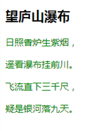
## 1.5、CSS基本选择器

#### 标签选择器
``` HTML标签作为标签选择器的名称
<h1>...<h6>、<p>、
```
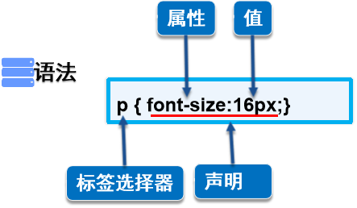
#### 类选择器

#### 一些特殊的实现效果，单纯使用标签选择器不能实现，从而引出类选择器


#### ID选择器

#### ID选择器的名称就是HTML中标签的ID名称，ID全局唯一

#### 小结
- 标签选择器直接应用于HTML标签
- 类选择器可在页面中多次使用
- ID选择器在同一个页面中只能使用一次
#### 基本选择器的优先级
```
 ID选择器>类选择器>标签选择器
```
- 标签选择器是否也遵循“就近原则”？

**不遵循，无论是哪种方式引入CSS样式，一般都遵循ID选择器 > class类选择器 > 标签选择器的优先级**

## 1.6、CSS高级选择器

### 1 、层次选择器


#### 后代选择器
```
body p{
background: red;
}
```

#### 后代选择器两个选择符之间必须要以空格隔开，中间不能有任何其他的符号插入

#### 子选择器
```
body>p{
background: pink;
}
```


#### 相邻兄弟选择器

```
.active+p {
background: green;
}
```


#### 通用兄弟选择器
```
.active~p{
background: yellow;
}
```

### 2 、结构伪类选择器


```
<html>
<head lang="en">
<meta charset="UTF-8">
<title>使用CSS3结构伪类选择器</title>
</head>

<body>
<p>p1</p>
<p>p2</p>
<p>p3</p>
<ul>
<li>li1</li>
<li>li2</li>
<li>li3</li>
</ul>
</body>
</html>
```


#### 标红的重点强调下，其他的可以略讲
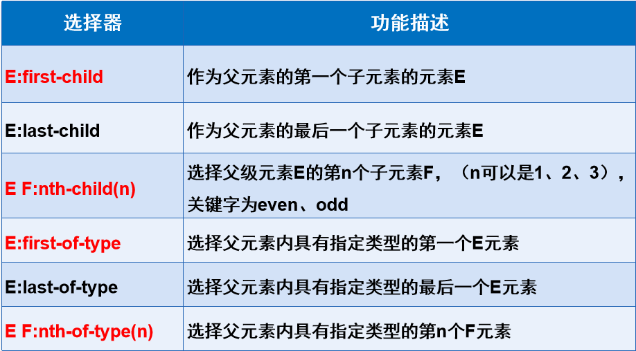

```
ul li:first-child{ background: red;}
ul li:last-child{ background: green;}
p:nth-child( 1 ){ background: yellow;}
p:nth-of-type( 2 ){ background: blue;}
```
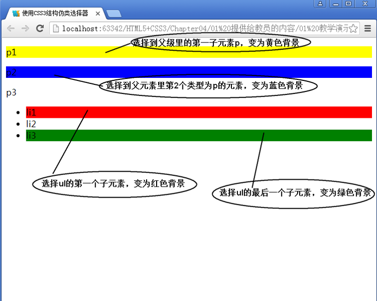


#### 小结


- 使用E F:nth-child(n)和E F:nth-of-type(n)的 关键点
	- E F:nth-child(n)在父级里从一个元素开始查找，不分类型
	- E F:nth-of-type(n)在父级里先看类型，再看位置

### 3 、属性选择器


**E[attr]属性选择器**
```
a[id] {
background: yellow;
}
```


**E[attr=val]属性选择器**

```
a[id=first] {
background: red;
}
```
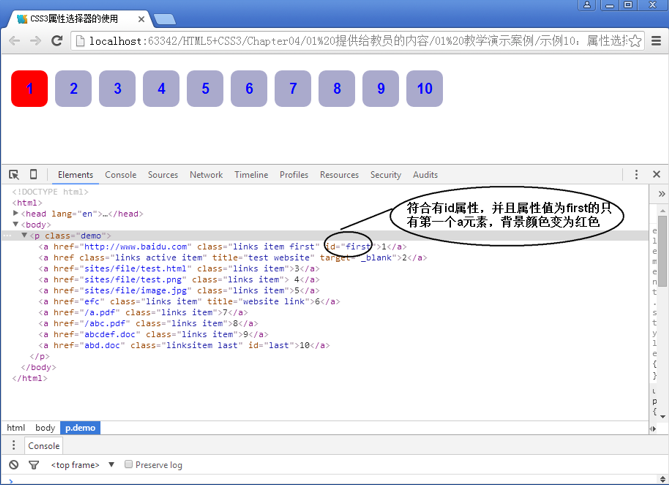

**E[attr*=val]属性选择器**

```
a[class*=links] {
background: red;
}
```


**E[attr^=val]属性选择器**

```
a[href^=http] {
background: red;
}
```


**E[attr$=val]属性选择器**
```
a[href$=png] {
background: red;
}
```


## 1.7、小结


# 2 、美化网页元素

#### 本章目标：

- 会使用CSS设置字体样式和文本样式
- 会使用CSS设置超链接样式
- 会使用CSS设置列表样式
- 会使用CSS设置背景样式
- 会使用CSS设置渐变效果

## 2.1、为什么使用CSS

#### 【查看淘宝页面，让学员观察，重点记住了什么东西】

#### 因此使用CSS样式美化网页文本具有如下意义。
 1. 有效的传递页面信息
 2. 使用CSS美化过的页面文本，使页面漂亮、美观，吸引用户
 3. 可以很好的突出页面的主题内容，使用户第一眼可以看到页面主要内容
 4. 具有良好的用户体验

< span>标签

< span>标签 的作用：能让某几个文字或者某个词语凸显出来，从而添加对应的样式！
```
1 <p>好好学习，<span>天天向上</span></p>
```
## 2.2、字体样式
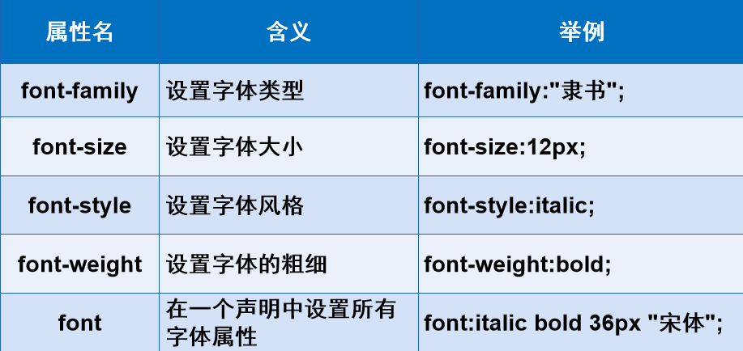

**字体类型** font-family
```
p{font-family:Verdana,"楷体";}
body{font-family: Times,"Times New Roman", "楷体";}
```

 同时设置中文和英文时，计算机如何识别中英文不同类型

**字体大小** font-size


- 单位
	- px（像素）
	- em、rem、cm、mm、pt、pc

```
h1{font-size:24px;}
h2{font-size:16px;}
h3{font-size:2em;}
span{font-size:12pt;}
strong{font-size:13pc;}
```
字体风格 font-style

normal、italic和oblique


字体的粗细 font-weight

字体属性 font

字体属性的顺序：字体风格→字体粗细→字体大小→字体类型
```
p span{
font:oblique bold 12px "楷体";
}
```
## 2.3、文本样式


**文本颜色color**


- RGB


	- 十六进制方法表示颜色：前两位表示红色分量，中间两位表示绿色分量，最后两位表示		蓝色分量
    	rgb(r,g,b) : 正整数的取值为 0 ～ 255
    - RGBA
   		- 在RGB基础上增加了控制alpha透明度的参数，其中这个透明通道值为 0 ～ 1

```
color:#A983D8;
color:#EEFF66;
color:rgb( 0 , 255 , 255 );
color:rgba( 0 , 0 , 255 ,0.5);
```
#### 排版文本段落

水平对齐方式：text-align属性
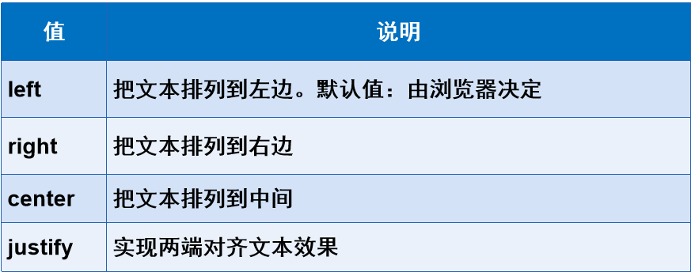
首行缩进：text-indent：em或px
行高：line-height：px

#### 文本修饰和垂直对齐

文本装饰：text-decoration属性（后面的讲解中会大量用到）

垂直对齐方式：vertical-align属性：middle、top、bottom


## 2.4、文本阴影
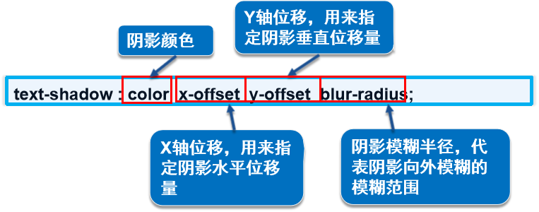

text-shadow属性在CSS2.0中出现，但迟迟未被各大浏览器所支持，因此在CSS2.1中被废弃，如今在
CSS3中得到了各大浏览器的支持！

#### 【练习】
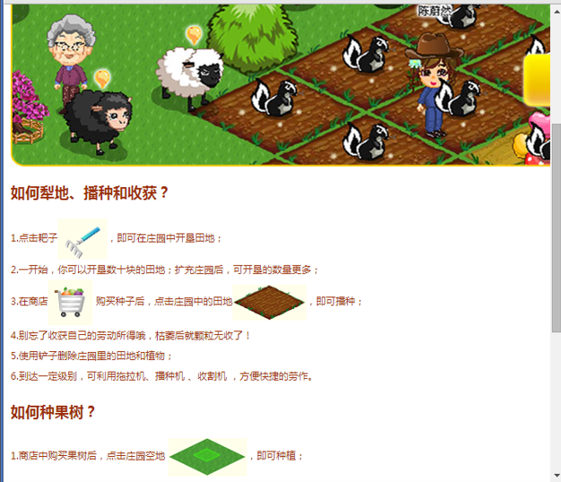


## 2.5、超链接伪类


#### 使用CSS设置超链接


实际网页开发中通常只设置两种状态，一是a{color:#333;}，一是a:hover { color:#B46210;}

## 2.6、列表样式


- list-style-type
- list-style-image
- list-style-position
- list-style


上网时大家都会看到在浏览的网页中用到列表时很少使用CSS自带的列表标记，而是使用设计的图标，那么大家会想使用list-style-image就可以了。可是list-style-position不能准确地定位图像标记的位置，通常，网页中图标的位置都是非常精确的。在实际的网页制作中，通常使用list-style或list-style-type设置项目无标记符号，然后通过背景图像的方式把设计的图标设置成列表项标记。在网页制作中，list-style和list-style-type两个属性是大家经常用到的，而另两个属性则不太常用，因此在这里大家牢记list-style和list-style-type的用法即可！


## 2.7、背景样式

#### 常见的背景样式

- 背景图像
    - background-image
-背景颜色
    - background-color

#### 设置背景图像

background-image属性
background-repeat属性


**背景定位：background-position属性**


#### 这些小三角，实现定位


#### 设置背景

背景属性：background属性（背景样式简写）

```
.title {
font-size:18px;
font-weight:bold;
color:#FFF;
text-indent:1em;
line-height:35px;
background:#C00 url(../image/arrow-down.gif) 205px 10px no-repeat;
}
background: 背景颜色 背景图像 背景定位 背景不重复显示
```
#### 1 2 3 4 5 6 7 8 9


背景尺寸 background-size


## 2.8、CSS渐变样式

网站推荐：http://color.oulu.me/


- 线性渐变
    -颜色沿着一条直线过渡：从左到右、从右到左、从上到下等
- 径向渐变
	- 圆形或椭圆形渐变，颜色不再沿着一条直线变化，而是从一个起点朝所有方向混合

#### CSS3渐变兼容
- IE浏览器是Trident内核，加前缀：-ms-
- Chrome浏览器是Webkit内核，加前缀：-webkit-
- Safari浏览器是Webkit内核，加前缀：-webkit-
- Opera浏览器是Blink内核，加前缀：-o-
- Firefox浏览器是Mozilla内核，加前缀：-moz-

#### 线性渐变
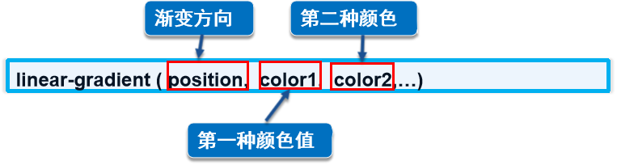

兼容Webkit内核的浏览器
```
1 -webkit-linear-gradient ( position,  color1,  color2,...)
```

## 2.9、小结


# 3 、盒子模型

#### 本章目标

- 理解盒子模型及其构成
- 会计算盒子模型尺寸
- 会使用盒子模型的两种解析方式来布局网页
- 会使用圆角属性给网页元素添加圆角效果
- 会使用盒子阴影属性给网页元素添加阴影效果

## 3.1、什么是盒子模型

#### 讲解盒子模型及属性，并说明边框、外边框和内边框都是四个边，最后介绍盒子模型的立体结构


## 3.2、边框

边框颜色 border-color


- 边框颜色设置方式与文本颜色对比讲解，都是使用十六进制
- 强调同时设置 4 个边框颜色时，顺序为上右下左
- 详细讲解分别上、下、左、右各边框颜色的不同设置方式，及属性值的顺序


边框粗细 border-width
- thin
- medium
- thick
- 像素值
```
border-top-width:5px;
border-right-width:10px;
border-bottom-width:8px;
border-left-width:22px;
border-width:5px ;
border-width:20px 2px;
border-width:5px 1px 6px;
border-width:1px 3px 5px 2px;
```
边框样式 border-style
- none
- hidden
- dotted
- dashed
- solid
- double

```
border-top-style:solid;
border-right-style:solid;
border-bottom-style:solid;
border-left-style:solid;
border-style:solid ;
border-style:solid dotted;
border-style:solid dotted dashed;
border-style:solid dotted dashed double;
```


border简写

同时设置边框的颜色、粗细和样式
```
border:1px solid #3a6587;
border: 1px dashed red;
```


## 3.3、内外边距

外边距 margin
- margin-top
- margin-right
- margin-bottom
- margin-left

```
margin-top: 1 px
margin-right : 2px
margin-bottom : 2px
margin-left : 1px
margin :3px 5px 7px 4px;
margin :3px 5px;
margin :3px 5px 7px;
margin :8px;
```
#### 外边距的妙用：网页居中对齐
```
1 margin:0px auto;
```
#### 网页居中对齐的必要条件
- 块元素
- 固定宽度


内边距 padding
- padding-left
- padding-right
- padding-top
- padding-bottom
```
padding-left:10px;
padding-right: 5px;
padding-top: 20px;
padding-bottom:8px;
padding:20px 5px 8px 10px ;
padding:10px 5px;
padding:30px 8px 10px ;
padding:10px;
```
## 3.4、盒子型模尺寸


**box-sizing**


```
<!DOCTYPE html>
<html>
<head lang="en">
<meta charset="UTF-8">
<title>box-sizing</title>
<style>
div{
width: 100px;
height: 100px;
padding: 5px;
margin: 10px;
border: 1px solid #000000;
box-sizing: border-box;
/*box-sizing: content-box; /!* 默认值*!/*/
}
</style>
</head>
<body>
<div></div>
</body>
</html>
```

## 3.5、圆角边框
```
1 border-radius: 20px 10px 50px 30px;
```
#### 四个属性值按顺时针排列


**border-radius制作特殊图形：圆形**

利用border-radius属性制作圆形的两个要点
- 元素的宽度和高度必须相同
- 圆角的半径为元素宽度的一半，或者直接设置圆角半径值为50%

```
div{
width: 100px;
height: 100px;
border: 4px solid red;
border-radius: 50%;
}
```


```
<!DOCTYPE html>
<html>
<head lang="en">
<meta charset="UTF-8">
<title>border-radius制作圆形</title>
<style>
div{
width: 100px;
height: 100px;
border: 4px solid red;
border-radius: 50%;
	}
</style>
</head>
<body>
<div></div>
</body>
</html>
```


**使用border-radius制作特殊图形：半圆形**

利用border-radius属性制作半圆形的两个要点
- 制作上半圆或下半圆时，元素的宽度是高度的 2 倍，而且圆角半径为元素的高度值
- 制作左半圆或右半圆时，元素的高度是宽度的 2 倍，而且圆角半径为元素的宽度值


```
<!DOCTYPE html>
<html>
<head lang="en">
<meta charset="UTF-8">
<title>border-radius制作半圆形</title>
<style>
div{
background: red;
margin: 30px;
}
div:nth-of-type( 1 ){
width: 100px;
height: 50px;
border-radius: 50px 50px 0 0 ;
}
div:nth-of-type( 2 ){
width: 100px;
height: 50px;
border-radius: 0 0 50px 50px;
}
div:nth-of-type( 3 ){
width: 50px;
height: 100px;
border-radius: 0 50px 50px  0 ;
}
div:nth-of-type( 4 ){
width: 50px;
height: 100px;
border-radius: 50px 0 0 50px;
}
</style>
</head>
<body>
<div></div>
<div></div>
<div></div>
<div></div>
</body>
</html>
```


**使用border-radius制作特殊图形：扇形**

利用border-radius属性制作扇形遵循“三同，一不同”原则
- “三同”是元素宽度、高度、圆角半径相同
- “一不同”是圆角取值位置不同


```
<!DOCTYPE html>
<html>
<head lang="en">
<meta charset="UTF-8">
<title>border-radius制作扇形</title>
<style>
div{
background: red;
margin: 30px;
}
div:nth-of-type( 1 ){
width: 50px;
height: 50px;
border-radius: 50px 0 0 0 ;
}

div:nth-of-type( 2 ){
width: 50px;
height: 50px;
border-radius: 0 50px 0 0 ;
}
div:nth-of-type( 3 ){
width: 50px;
height: 50px;
border-radius: 0 0 50px 0 ;
}
div:nth-of-type( 4 ){
width: 50px;
height: 50px;
border-radius: 0 0 0 50px;
}
</style>
</head>
<body>
<div></div>
<div></div>
<div></div>
<div></div>
</body>
</html>
```

## 3.6、盒子阴影


```
<!DOCTYPE html>
<html>
<head lang="en">
<meta charset="UTF-8">
<title>box-shadow的使用</title>
<style>
div{
width: 100px;
height: 100px;
border: 1px solid red;
border-radius: 8px;
margin: 20px;
/*box-shadow: 20px 10px 10px #06c; /!*内阴影*!/*/

/*box-shadow: 0px 0px 20px #06c; /!*只设置模糊半径的阴影
*!/*/
box-shadow: inset 3px 3px 10px #06c; /*内阴影*/
}
</style>
</head>
<body>
<div></div>
</body>
</html>
```


## 3.7、小结

# 4 、浮动

#### 本章目标：


- 会使用display属性排版网页元素
- 会使用float属性排版网页元素
 会使用float属性创建横向多列布局
- 会使用四种防止父级边框塌陷的清除浮动的方法

## 4.1、标准文档流

 标准文档流：指元素根据块元素或行内元素的特性按从上到下，从左到右的方式自然排列。这也是元素默认的排列方式

#### 标准文档流组成
- 块级元素（block）
```
1 <h1>...<h6>、<p>、<div>、列表
```
- 内联元素（inline）
```
1 <span>、<a>、、<strong>...
```
内联标签可以包含于块级标签中，成为它的子元素，而反过来则不成立

## 4.2、display

**display属性**
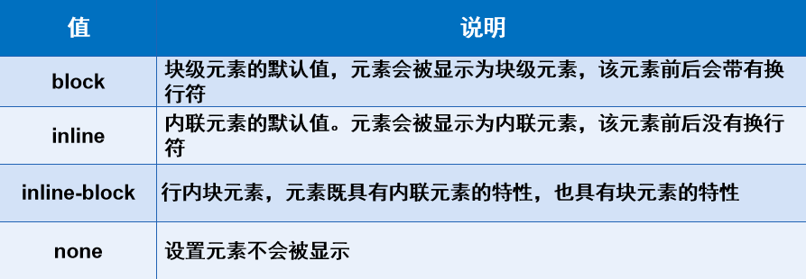
```
display:block;
```

```
display:inline;
```

```
display:inline-block;
```


```
1 display:none;
```


display特性
- 块级元素与行级元素的转变（ block、inline ）
- 控制块元素排到一行（ inline-block ）
- 控制元素的显示和隐藏（ none ）

【操作—制作QQ会员页面导航】

- 导航背景颜色为黑色半透明效果
- 鼠标移入“功能特权”等导航信息时文字颜色变为蓝色，无下划线
- “登录”部分信息使用超链接实现，添加圆角边框，鼠标移入字体颜色加深，添加背景颜色为黄色


#### 块元素排在一行的方法

可以使用什么属性使块元素排在一行？
- inline-block
- float
刚刚学过的inline-block；然后介绍还有一种方式可以实现让块元素排在一行。引出浮动。

## 4.3、浮动

float属性

```
<body>
<div id="father">
<div class="layer01">
</div>
<div class="layer02"></div>
<div class="layer03"></div>
<div class="layer04">浮动的盒子......</div>
</div>
</body>
```
#### 左浮动
```
.layer01 {
border:1px #F00 dashed;
float:left;
}
.layer02 {
border:1px #00F dashed;
float:left;
}
.layer03 {
border:1px #060 dashed;
float:left;
}
```
#### 右浮动
```
.layer01 {
border:1px #F00 dashed;
float:right;
}
.layer02 {
border:1px #00F dashed;
float:right;
}
```


## 4.4、边框塌陷

layer04设置宽度和右浮动后，为什么边框塌陷了？怎么解决？


- 浮动元素脱离标准文档流
- 清除浮动

**clear属性**

```
.layer04 {
clear:both; #清除两侧浮动
}
.layer04 {
clear:left; #清除左侧浮动
}
.layer04 {
clear:right;  #清除右侧浮动
}
```
#### 解决父级边框塌陷的方法

clear属性可以清除浮动对其他元素造成的影响，可是依然解决不了父级边框塌陷问题，怎么办？
- 浮动元素后面加空div
```
<div id="father">
<div class="layer01"></div>
<div class="layer02"></div>
<div class="layer03"></div>
<div class="layer04">浮动的盒子......</div>
<div class="clear"></div>
</div>
.clear{ clear: both; margin: 0; padding: 0;}
```
- 设置父元素的高度
```
<div id="father">
<div class="layer01"></div>
<div class="layer02"></div>
<div class="layer03"></div>
<div class="layer04">浮动的盒子......</div>
</div>
#father {height: 400px; border:1px #000 solid; }
```
- 父级添加overflow属性（溢出处理）

hidden属性值，这个值在网页中经常使用，通常与< div>宽度结合使用设置< div>自动扩展高度，或者隐藏超出的内容
```
<div id="father">
<div class="layer01"></div>
<div class="layer02"></div>
<div class="layer03"></div>
<div class="layer04">浮动的盒子......</div>
</div>
#father {overflow: hidden;border:1px #000 solid; }
```
- 父级添加伪类after
```
<div id="father" class="clear">
<div class="layer01"></div>
<div class="layer02"></div>
<div class="layer03"></div>
<div class="layer04">浮动的盒子......</div>
</div>
.clear:after{
content: ''; /*在clear类后面添加内容为空*/
display: block; /*把添加的内容转化为块元素*/
clear: both; /*清除这个元素两边的浮动*/
}
```


#### 小结

#### 【清除浮动，防止父级边框塌陷的四种方法】


- 浮动元素后面加空div
	- 简单，空div会造成HTML代码冗余
- 设置父元素的高度
	- 简单，元素固定高会降低扩展性
- 父级添加overflow属性
	- 简单，下拉列表框的场景不能用
- 父级添加伪类after
	- 写法比上面稍微复杂一点，但是没有副作用，推荐使用
```
【操作】


## 4.5、inline-block和float区别
- display:inline-block
	- 可以让元素排在一行，并且支持宽度和高度，代码实现起来方便
	- 位置方向不可控制，会解析空格
	- IE 6、IE 7上不支持
- float
	- 可以让元素排在一行并且支持宽度和高度，可以决定排列方向
    - float 浮动以后元素脱离文档流，会对周围元素产生影响，必须在它的父级上添加清浮动的样式

## 4.6、小结


# 5 、定位
#### 本章目标：
- 会使用position定位网页元素
- 会使用z-index属性调整定位元素的堆叠次序
 
## 5.1、定位在网页中的应用


## 5.2、相对定位
**position属性**
static：默认值，没有定位


relative：相对定位

相对自身原来位置进行偏移，偏移设置：top、left、right、bottom
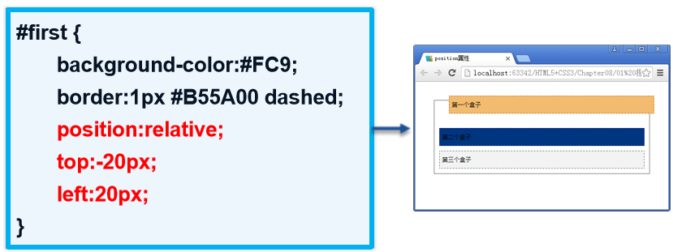

#### 相对定位元素的规律

 设置相对定位的盒子会相对它原来的位置，通过指定偏移，到达新的位置
 设置相对定位的盒子仍在标准文档流中，它对父级盒子和相邻的盒子都没有任何影响
 设置相对定位的盒子原来的位置会被保留下来

#### 设置第二个盒子右浮动，再设置第一、第二盒子相对定位

``` hmtl
#first {
background-color:#FC9;
border:1px #B55A00 dashed;
position:relative;
right:20px;
bottom:20px;
}
#second {
background-color:#CCF;
border:1px #0000A8 dashed;
float:right;
position:relative;
left:20px;
top:-20px;
}
```
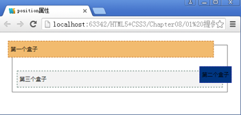
#### 操作：

- 使用
 和超链接布局页面
- 每个超链接宽度和高度都是100px，背景颜色是粉色，鼠标指针移上去时变为蓝色
- 使用相对定位改变每个超链接的位置


## 5.3、绝对定位

absolute属性值：偏移设置： left、right、top、bottom

绝对定位：
- 使用了绝对定位的元素以它最近的一个“已经定位”的“祖先元素” 为基准进行偏移
- 如果没有已经定位的祖先元素，会以浏览器窗口为基准进行定位
 绝对定位的元素从标准文档流中脱离，这意味着它们对其他元素的定位不会造成影响
- 元素位置发生偏移后，它原来的位置不会被保留下来

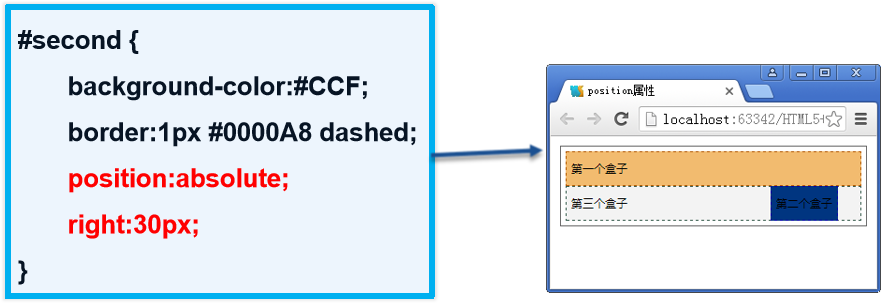
> 设置了绝对定位但没有设置偏移量的元素将保持在原来的位置。

> 在网页制作中可以用于需要使某个元素脱离标准流，而仍然希望它保持在原来的位置的情况

## 5.4、固定定位

**fixed属性值**

偏移设置： left、right、top、bottom


#### 类似绝对定位，不过区别在于定位的基准不是祖先元素，而是浏览器窗口
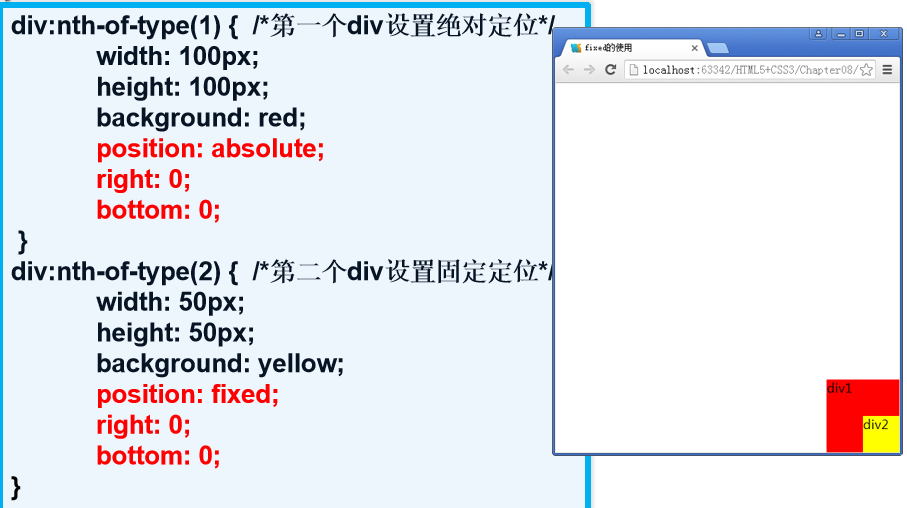

## 5.5、定位小结

#### 相对定位

- 相对定位的特性
	- 相对于自己的初始位置来定位
	- 元素位置发生偏移后，它原来的位置会被保留下来
	- 层级提高，可以把标准文档流中的元素及浮动元素盖在下边
- 相对定位的使用场景
	- 相对定位一般情况下很少自己单独使用，都是配合绝对定位使用，为绝对定位创造定位父级而又不设置偏移量

#### 绝对定位


- 绝对定位的特性
    - 绝对定位是相对于它的定位父级的位置来定位，如果没有设置定位父级，则相对浏览器窗口来定位
    - 元素位置发生偏移后，原来的位置不会被保留
    - 层级提高，可以把标准文档流中的元素及浮动元素盖在下边
    - 设置绝对定位的元素脱离文档流
- 绝对定位的使用场景
	- 一般情况下，绝对定位用在下拉菜单、焦点图轮播、弹出数字气泡、特别花边等场景

#### 固定定位
- 固定定位的特性
    - 相对浏览器窗口来定位
    - 偏移量不会随滚动条的移动而移动
- 固定定位的使用场景
	- 一般在网页中被用在窗口左右两边的固定广告、返回顶部图标、吸顶导航栏等

## 5.6、z-index属性

- 调整元素定位时重叠层的上下位置
    - z-index属性值：整数，默认值为 0
    - 设置了positon属性时，z-index属性可以设置各元素之间的重叠高低关系
    - z-index值大的层位于其值小的层上方

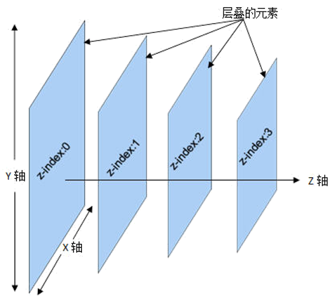

#### 网页元素透明度


#### 小结

网页中的元素都含有两个堆叠层级
未设置绝对定位时所处的环境，z-index是 0
设置绝对定位时所处的堆叠环境，此时层的位置由z-index的值确定
改变设置绝对定位和没有设置绝对定位的层的上下堆叠顺序，只需调整绝对定位层的z-index值即可

## 5.7、小结


# 6 、制作网页动画

#### 本章目标
- 会使用transform 2D变形设置网页元素样式
- 会使用transition制作过渡动画
- 会使用animation制作网页动画

#### 如何在网页中实现动画效果？
1. 动态图片
2. Flash
3. JavaScript

Flash需要插件支持，文件体积大

从这次课开始学习使用CSS代码来完成动画：存在兼容性问题
- CSS3变形
- CSS3过渡
- CSS3动画

## 6.1、CSS变形

- CSS3变形是一些效果的集合
    - 如平移、旋转、缩放、倾斜效果
    - 简言之，平移就是一个变形，旋转就是一个变形。。。


- 每个效果都可以称为变形（transform），它们可以分别操控元素发生平移、旋转、缩放、倾斜等变化


#### 变形函数
- translate()：平移函数，基于X、Y坐标重新定位元素的位置
- scale()：缩放函数，可以使任意元素对象尺寸发生变化
- rotate()：旋转函数，取值是一个度数值
- skew()：倾斜函数，取值是一个度数值

#### 2D位移


#### 一个方向上的偏移


#### 2D缩放

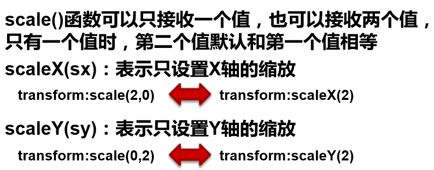

scale()函数能够用来缩放元素大小，该函数包含两个参数值，分别用来定义宽度和高度的缩放比例，默
认值为 1 ， 0 ～0.99的任意值都可以使元素缩小，而任何大于 1 的值都能让元素放大。
scale()函数和translate()函数的语法非常相似，可以只接收一个值，也可以接收两个值，只有一个值
时，第二个值默认和第一个值相等，例如，scale（ 1 ， 1 ）元素不会有任何变化，而scale（ 2 ， 2 ）会让
元素放大 2 倍

#### 2D倾斜

#### 可以仅设置沿着X轴或Y轴方向倾斜


- skewX（ax）：表示只设置X轴的倾斜
- skewY（ay）：表示只设置Y轴的倾斜


#### 2D旋转

```
1 rotate(a);
```
- 参数a单位使用deg表示
- 参数a取正值时元素相对原来中心顺时针旋转

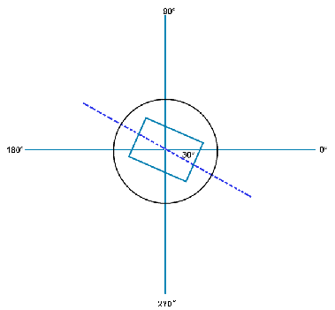
#### 小结：
rotate( )函数只是旋转，而不会改变元素的形状
skew( )函数是倾斜，元素不会旋转，会改变元素的形状

## 6.2、CSS过渡

transition呈现的是一种过渡，是一种动画转换的过程，如渐现、渐弱、动画快慢等
CSS3 transition的过渡功能更像是一种“黄油”，通过一些CSS的简单动作触发样式平滑过渡
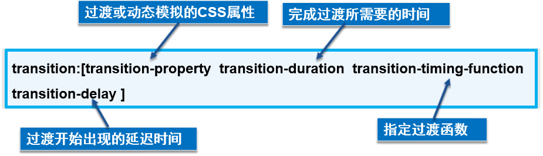


#### 过渡属性的使用
- 过渡属性（ transition-property ）
    -定义转换动画的CSS属性名称
        - IDENT：指定的CSS属性（width、height、background-color属性等）
        -all：指定所有元素支持transition-property属性的样式，一般为了方便都会使用all

> 设置过渡中背景颜色，让学员观察到div的背景颜色的变化。


- 过渡所需的时间（ transition-duration ）
    -定义转换动画的时间长度，即从设置旧属性到换新属性所花费的时间，单位为秒（s）

> 设置过渡第二个参数，分别设置时间长短，让学员明显观察到这个参数的作用及使用场景


- 过渡动画函数（ transition-timing-function ）
    - 指定浏览器的过渡速度，以及过渡期间的操作进展情况，通过给过渡添加一个函数来指定动画的快慢方式
        - ease：速度由快到慢（默认值）
        - linear：速度恒速（匀速运动）
        - ease-in：速度越来越快（渐显效果）
        - ease-out：速度越来越慢（渐隐效果）
        - ease-in-out：速度先加速再减速（渐显渐隐效果）

> 演示大概2-3个动画函数的值，让学员理解第三个参数（动画函数）的作用及使用场景

- 过渡延迟时间（ transition-delay ）
    - 指定一个动画开始执行的时间，当改变元素属性值后多长时间去执行过渡效果
        - 正值：元素过渡效果不会立即触发，当过了设置的时间值后才会被触发
        - 负值：元素过渡效果会从该时间点开始显示，之前的动作被截断
        - 0 ：默认值，元素过渡效果立即执行

> 设置第四个参数，过渡延迟时间，让学员能明白过这个参数的作用及使用场景


#### 过渡的触发机制

- 伪类触发
    - ：hover
    - ：active
    - ：focus
    - ：checked
- 媒体查询：通过@media属性判断设备的尺寸，方向等
- JavaScript触发：用JavaScript脚本触发

**注意：** 媒体查询和JavaScript的方法在后面课程会详细讲解，现在只需要大家了解即可。重点需要掌握伪类触发的方法，这种方法也是实际开发中用的比较多的一种

使用transition实现过渡动画的使用步骤
    - 在默认样式中声明元素的初始状态样式
    - 声明过渡元素最终状态样式，如悬浮状态
    - 在默认样式中通过添加过渡函数，添加一些不同的样式

## 6.3、CSS动画


- animation动画简介
    - animation实现动画主要由两个部分组成
        - 通过类似Flash动画的关键帧来声明一个动画
        - 在animation属性中调用关键帧声明的动画实现一个更为复杂的动画效果

#### CSS3动画的使用过程

- 设置关键帧


- @keyframes的浏览器兼容性

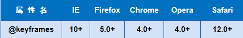

写兼容的时候浏览器前缀是放在@keyframes中间
例如：@-webkit-keyframes、@-moz- keyframes

- 调用关键帧


- 动画的播放次数（animation-iteration-count）
    - 值通常为整数，默认值为 1
    - 特殊值infinite，表示动画无限次播放
- 动画的播放方向（animation-direction）
    - normal，动画每次都是循环向前播放
    - alternate，动画播放为偶数次则向前播放
- 动画的播放状态（animation-play-state）
    - running将暂停的动画重新播放
    - paused将正在播放的元素动画停下来
- 动画发生的操作（animation-fill-mode）
    - forwards表示动画在结束后继续应用最后关键帧的位置
    - backwards表示会在向元素应用动画样式时迅速应用动画的初始帧
    - both表示元素动画同时具有forwards和backwards的效果

## 6.4、总结

