## 

## JS相关：

### 闭包

>   答：闭包说的通俗一点就是打通了一条在函数外部访问函数内部作用域的通道。正常情况下函数外部是访问不到函数内部作用域变量的，

>   表象判断是不是闭包:函数嵌套函数,内部函数被return
>   内部函数调用外层函数的局部变量

>   优点：可以隔离作用域，不造成全局污染

>   缺点：由于闭包长期驻留内存，则长期这样会导致内存泄露

>   如何解决内存泄露：将暴露全外部的闭包变量置为null

>   适用场景：封装组件，for循环和定时器结合使用,for循环和dom事件结合.可以在性能优化的过程中,节流防抖函数的使用,导航栏获取下标的使用

### 说一下JS中的原型链的理解？

1.  **什么原型 原型链**

    **原型：**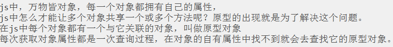

    原型链：

    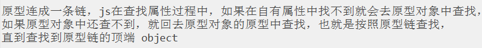

2.  **有什么用，怎么用的**

    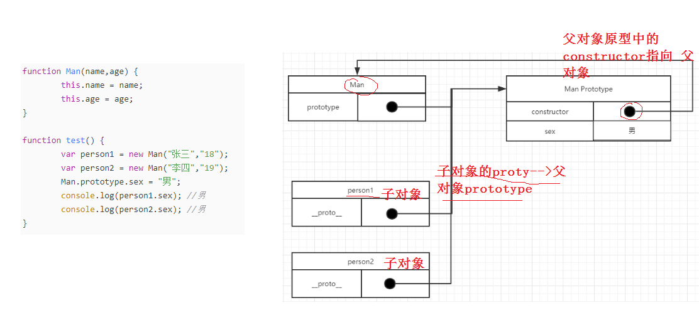

    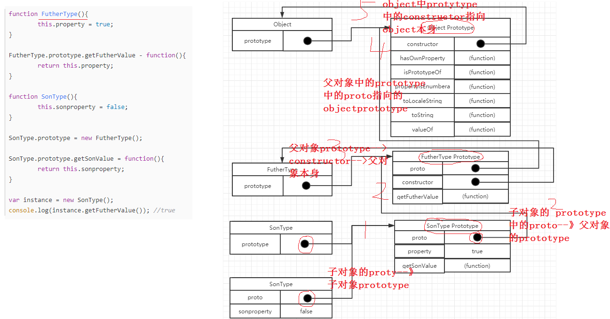

3.  **优缺点**

    原型链继承的缺点

    优点：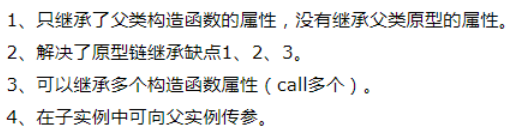

    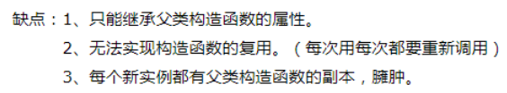

4.  **说一下JS继承（含ES6的）--或者人家这样问有两个类A和B,B怎么继承A？**

5.  **什么是继承： 官方概念**

    通过【某种方式】让一个对象可以访问到另一个对象中的属性和方法

    Js中继承 es6中的继承

6.  **继承有什么用：**

    **如何实现继承：**

    **构造函数继承 原型 原型连继承 拷贝继承(混入继承：mixin)**

7.  **原型继承：**

    让新实例的原型等于父类的实例

    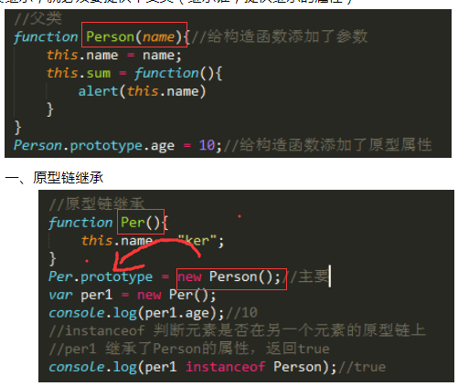

    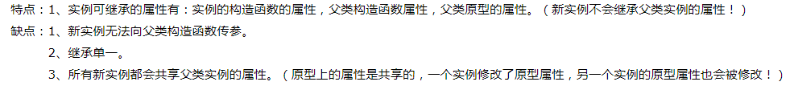

8.  **原型链继承**

    用.call()和.apply()将父类构造函数引入子类函数

    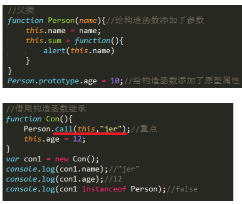

    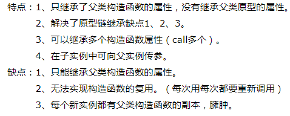

9.  **构造函数继承**

10. **混合继承**

11. **继承的优缺点：**

Es6继承

ES6继承是目前比较新，并且主流的继承方式，用class定义类，用extends继承类，用super()表示父类,【下面代码部分只是熟悉，不用说课】

例如：创建A类

class A ｛

constructor() {

//构造器代码，new时自动执行

}

方法1( ) { //A类的方法 }

方法2( ) { //A类的方法 }

｝

创建B类并继承A类

class B extends A {

constructor() {

super() //表示父类

}

}

实例化B类： var b1=new B( )

b1.方法1( )

### 说一下JS原生事件如何绑定 \*\*\*\*

>   答：JS原生绑定事件主要为三种：

>   一是html事件处理程序

>   二是DOM0级事件处理程序

>   三是DOM2级事件处理程序

其中：html事件现在早已不用了，就是在html各种标签上直接添加事件，类似于css的行内样式，缺点是不好维护，因为散落在标签中,也就是耦合度太高

例如：\<button onclick=”事件处理函数”\>点我\</button\>

第二类是DOM0级事件，目前在PC端用的还是比较多的绑定事件方式，兼容性也好，主要是先获取dom元素，然后直接给dom元素添加事件

例如：var btn=document.getElementById(‘id元素’)

btn.onclick=function() {

//要处理的事件逻辑

}

DOM0事件如何移除呢？很简单：btn.onclick=null;置为空就行

优点：兼容性好

缺点：只支持冒泡，不支持捕获

第三类是DOM2级事件，移动端用的比较多，也有很多优点，提供了专门的绑定和移除方法

例如： var btn=document.getElementById(‘id元素’)

//绑定事件

btn.addEventListener(‘click’,绑定的事件处理函数名,false)

//移除事件

btn.removeEventListener(‘click’,要移除的事件处理函数名，false)

优点：支持给个元素绑定多个相同事件，支持冒泡和捕获事件机制

### 说一下JS原生常用dom操作方法？

>   答：js原生dom操作方法有？

>   查找：getElementByid,

>   getElementsByTagName,

>   querySelector,

>   querySelectorAll

插入：appendChild,insertBefore

删除：removeChild

克隆：cloneNode

设置和获取属性：setAttribute(“属性名”,”值”),getAttibute(“属性名”)

1.  **说一下ES6新增特性?**

    答：ES6新增特性常用的主要有：let/const,箭头函数，模板字符串，解构赋值，模块的导入(import)和导出(export
    default/export),Promise,还有一些数组字符串的新方法,其实有很多，我平时常用的就这些

### (了解)JS设计模式有哪些(单例模式观察者模式等)

>   答：JS设计模式有很多，但我知道的有单例模式，观察者模式

>   单例模式：就是保证一个类只有一个实例，实现的方法一般是先判断实例存在与否，如果存在直接返回，如果不存在就创建了再返回，这就确保了一个类只有一个实例对象。在JavaScript里，单例作为一个命名空间提供者，从全局命名空间里提供一个唯一的访问点来访问该对象。

>   观察者模式:
>   观察者的使用场合就是：当一个对象的改变需要同时改变其它对象，并且它不知道具体有多少对象需要改变的时候，就应该考虑使用观察者模式。

>   总的来说，观察者模式所做的工作就是在解耦，让耦合的双方都依赖于抽象，而不是依赖于具体。从而使得各自的变化都不会影响到另一边的变化

### 说一下你对JS面试对象的理解

>   什么是面向对象

>   将所需要做的功能抽象成一个“对象”，然后反复调用这个对象来完成你想要的功能

>   面向对象用法

1.  》创建对象：

    用object创建

    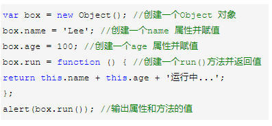

    缺点，想创建多个类似的对象，就会产生大量的代码。

    工厂模式创建对象：

    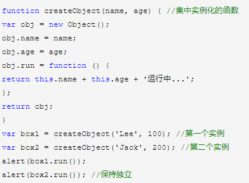

    工厂模式解决了重复实例化的问题，缺点，创建不同对象其中属性和方法都会重复建立，消耗内存；还有函数识别问题等等。

    字面量创建对象

    Var obj ={}

    构造函数的方法创建对象

    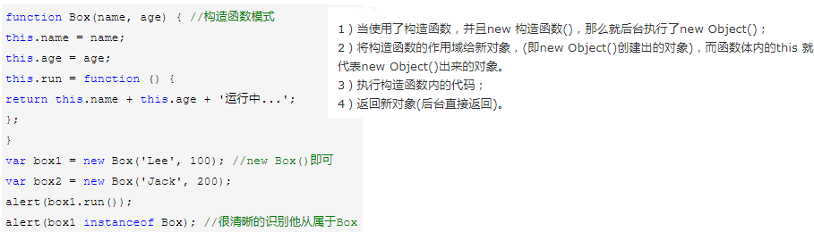

### 原型

### 继承

>   说一下es6的面向对象：

>   ES6有了个关键字：Class，来定义类

>   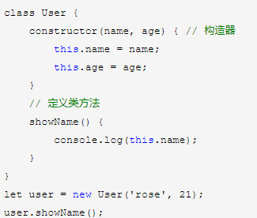

>   ES6的class 有了专门的构造器
>   constructor，构造器和类分开了，定义方法：不需要原型来定义了，直接再类里面定义方法

>   Es6声明类的方法

>   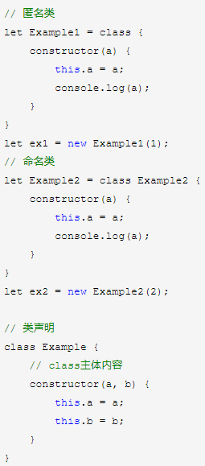

>   ES6的继承：关键字：extends 继承、super 超级

1.  constructor 构造器里面的this是指向创建的实例对象

2.  方法里面的this都是指向 谁 调用这个方法就指向 谁

### 说一下JS数组常用方法（至少6个）

>   答：在开发中，数组使用频率很频繁，JS数组常用方法有:push,pop,unshift,shift,splice,join,concat,forEach,filter,map,sort,some,every好多，不过都是平时开发中很常用的方法,大家可以补充一点儿es6的

### 说一下JS数组内置遍历方法有哪些和区别

>   答：JS数组内置遍历（遍历就是循环的意思）方法主要有：

>   **forEach:**这个方法是为了取代for循环遍历数组的，返回值为undefined例如：

>   let arrInfo=[4,6,6,8,5,7,87]

>   arrInfo.forEach((item,index,arr)=\>{

>   //遍历逻辑

>   })

>   其中：

>   item代码遍历的每一项,

>   index:代表遍历的每项的索引，

>   arr代表数组本身

>   **filter:**是一个过滤遍历的方法，如果返回条件为true，则返回满足条件为true的新数组

>   let arrInfo=[4,16,6,8,45,7,87]

let resultArr=arrInfo.filter((item,index,arr)=\>{

>   //例如返回数组每项值大于9的数组

>   return item\>9

>   })

>   **map:**这个map方法主要对数组的复杂逻辑处理时用的多，特别是react中遍历数据，也经常用到，写法和forEach类似

>   **some:**这个some方法用于只要数组中至少存在一个满足条件的结果，返回值就为true,否则返回fasel,
>   写法和forEach类似

>   **every:**这个every方法用于数组中每一项都得满足条件时，才返回true，否则返回false,
>   写法和forEach类似

### 说一下JS作用域和作用域链

>   答：JS作用域也就是JS识别变量的范围，作用域链也就是JS查找变量的顺序

>   先说作用域，JS作用域主要包括全局作用域、局部作用域和ES6的块级作用域

>   全局作用域：也就是定义在window下的变量范围，在任何地方都可以访问，

>   局部作用域：是只在函数内部定义的变量范围

>   块级作用域：简单来说用let和const在任意的代码块中定义的变量都认为是块级作用域中的变量，例如在for循环中用let定义的变量，在if语句中用let定义的变量等等

>   注：尽量不要使用全局变量，因为容易导致全局的污染，命名冲突，对bug查找不利。

>   2️而所谓的作用域链就是由最内部的作用域往最外部,查找变量的过程.形成的链条就是作用域链

>   缺案例的描述：

### 说一下从输入URL到页面加载完中间发生了什么？

>   答：大致过程是这样的：

1.  DNS解析

2.  TCP连接

3.  发送HTTP请求

4.  服务器处理请求并返回需要的数据

5.  浏览器解析渲染页面

6.  连接结束

输入了一个域名,域名要通过DNS解析找到这个域名对应的服务器地址(ip),通过TCP请求链接服务,通过WEB服务器(apache)返回数据,浏览器根据返回数据构建DOM树,通过css渲染引擎及js解析引擎将页面渲染出来,关闭tcp连接

### 说一下JS事件代理（也称事件委托）是什么，及实现原理？

>   答：JS事件代理就是通过给父级元素（例如：ul）绑定事件，不给子级元素(例如：li)绑定事件，然后当点击子级元素时，通过事件冒泡机制在其绑定的父元素上触发事件处理函数，主要目的是为了提升性能，因为我不用给每个子级元素绑定事件，只给父级元素绑定一次就好了,在原生js里面是通过event对象的targe属性实现

>   var ul = document.querySelector("ul");

>   ul.onclick = function(e){//e指event,事件对象

>   var target = e.target \|\| e.srcElement; //target获取触发事件的目标(li)

>   if(target.nodeName.toLowerCase() ==
>   'li'){//目标(li)节点名转小写字母，不转的话是大写字母

>   alert(target.innerHTML)

>   }

>   }

>   jq方式实现相对而言简单 \$(“ul”).on(“click”,“li”,function(){//事件逻辑})
>   其中第二个参数指的是触发事件的具体目标，**特别是给动态添加的元素绑定事件，这个特别起作用**

### 说一下JS数据类型有哪些？

>   答：JS数据类型有：

>   基本数据类型：number,string,Boolean,null,undefined,symbol（ES6新增）

>   复合类型：Object,function

### 说一下call,apply,bind区别

>   答：call,apply,bind主要作用都是改变this指向的，但使用上略有区别，说一下区别:

>   call和apply的主要区别是在传递参数上不同，**call后面传递的参数是以逗号的形式分开的，apply传递的参数是数组形式
>   [Apply是以A开头的,所以应该是跟Array(数组)形式的参数]**

>   bind返回的是一个函数形式，如果要执行，则后面要再加一个小括号
>   例如：bind(obj,参数1,参数2,)(),bind只能以逗号分隔形式，不能是数组形式

### git相关：

1.  你们公司项目是如何管理的？

    答：主要通过git来进行项目版本控制的

2.  说几个git常用命令？

    答：我工作中常用的有git add ,git status,git commit –m,git push,git pull等

3.  说一下多人操作同一个文件，如果出现冲突该如何解决？

    答：当遇到多人协作修改同一个文件时出现冲突，我先将远程文件先git
    pull下来，手动修改冲突代码后，再git add ,git commit,git
    push再上传到远程仓库。如果pull也pull不下来提示冲突的话，可以先通过git
    stash暂存下来，然后再pull拉取，然后git stash
    pop，取出原来写的，手动修改，然后提交

**Ajax相关：**

1.  说一下你是如何与后端进行数据交互的

    答：我和后端通过ajax来进行数据交互的，通过统一制定的接口文档，来实现前后端高效开发，如果接口文档不能详细说明，或者接口文档上的参数请求不出数据，我会主动和后端工程师沟通，直到完成跟接口相关的业务开发。当然这其中为了验证一些接口问题，会用到一些辅助工具，比方说，runapi这种在线测试工具

2.  如果后端数据接口没有准备好，你是如何工作的

    答：如果后端接口还没有准备好，我会和后端工程师沟通，通过制定接口返回数据的格式，然后前端通过一些mock数据的工具（上家公司使用的是easymock,贼简单）来批量生成假数据，可以让前端和后端同时开发，而无需等待后端数据接口写好再开发，这样提升项目整体的开发效率

3.  说一下你对ajax的同源策略的理解

    答：ajax同源策略是因为安全的考虑，ajax不允许访问不同域名下的资源即所谓同源策略的意思。

4.  说一下什么情况下会产生跨域及产生跨域的解决方案和实现原理？

    答：产生跨域的情况有：不同协议，不同域名，不同端口以及域名和ip地址的访问都会产生跨域。

    **跨域的解决方案目前有三种主流解决方案**：

    跨域是浏览器做出的限制,和后端没关系

5.  是jsonp

    jsonp实现原理：主要是利用动态创建script标签请求后端接口地址，然后传递callback参数，后端接收callback，后端经过数据处理，返回callback函数调用的形式，callback中的参数就是json

6.  是代理（前端代理和后端代理）

    前端代理我在vue中主要是通过vue脚手架中的config中的index文件来配置的，其中有个proxyTable来配置跨域的

7.  是CORS

    CORS全称叫跨域资源共享，主要是后台工程师设置后端代码来达到前端跨域请求的

注：现在主流框架都是用代理和CORS跨域实现的

1.  说一下原生ajax的交互过程（即流程）

    答：交互流程：

    先创建XHR对象即XMLHttpRequest()

    然后open准备发送，open中有三个参数一是提交方式get和post,二是接口地址，三是同步和异步

    第三步是用send发送

    第四步再发送的过程中通过onreadystatechange来监听接收的回调函数，可以通过判断readyState＝＝4和status=＝200来判断是否成功返回，然后通过responseText接收成功返回的数据

### 说一下你对同步和异步的理解

>   答：同步即sync，形象的说就是代码一行行执行，前面代码和请求没有执行完，后面的代码和请求就不会被执行，

>   缺点：容易导致代码阻塞

>   优点：程序员容易理解（因为代码从上往下一行行执行，强调顺序）

>   异步：即async,形象的说就是代码可以在当前程序没有执行完，也可以执行后面的代码

>   缺点：程序员不易理解（因为不是按顺序执行的）

>   优点：可以解决代码阻塞问题，提升代码执行效率和性能

>   异步解决方案主要有三个：

1.  回调函数

2.  promise（重点掌握）

3.  generator(了解)

4.  async和await（重点掌握）

1.  **ajax缓存如何解决？**

    答：通过在文件名后面添加随机数（也称为文件指纹）来实现，主要原理是浏览器对访问过的文件，首先会检测第二次请求的文件url在浏览器是否缓存过，如果缓存过就使用，否则如果是一个新的文件url，则从服务器重新请求

2.  说一下javaScript原生,jQuery,vue,react,小程序ajax与后台交互主要用的什么技术

    答：javaScript原生Ajax：用的是XMLHttpRequest对象

    jQuery中的Ajax: \$.ajax(),\$.getJSON(),\$.get(),\$.post()等

    vue中的Ajax:vue-resource（vue1.x中用）,axios(主流)

    微信小程序Ajax:用的是小程序内置的wx.request()写法和jquery的\$.ajax()类似，参数url,success，data,method,fail等

### 说一下你对http状态码的了解多少？

答：

1xx（临时响应）

表示临时响应并需要请求者继续执行操作的状态代码

2xx （成功）

表示成功处理了请求的状态码。

常见的2开头的状态码有：200 – 服务器成功返回网页

3xx （重定向）

表示要完成请求，需要进一步操作。 通常，这些状态代码用来重定向

常见的3字开头的状态码有：

>   **301 （永久移动） 请求的网页已永久移动到新位置。
>   服务器返回此响应时，会自动将请求者转到新位置。   
>   302 （临时移动）
>   服务器目前从不同位置的网页响应请求，但请求者应继续使用原有位置来进行以后的请求。
>   
>   **304 （未修改） 自从上次请求后，请求的网页未修改过。
>   服务器返回此响应时，不会返回网页内容。

4xx（请求错误） 这些状态代码表示请求可能出错，妨碍了服务器的处理。

>   常见的4字开头的状态有：404 – 请求的网页不存在

5xx（服务器错误）

这些状态代码表示服务器在尝试处理请求时发生内部错误。
这些错误可能是服务器本身的错误，而不是请求出错。

>   常见的以5开头的状态码有：  
>   500 （服务器内部错误） 服务器遇到错误，无法完成请求。   
>   503 （服务不可用） 服务器目前无法使用（由于超载或停机维护）。
>   通常，这只是暂时状态。

### 你上家公司项目是前后端分离的吗

>   答：对，是前后端分离的项目，但开始不是，开始前后端代码混在一起写的，后来重构成前后端分离的项目，方便前端和后端自己维护的代码

>   注：所谓前后端分离就是前后端职责明晰：后端只提供数据接口地址返回json数据，前端用ajax请求json数据，页面的所有业务逻辑都是前端来写，让前端控制力更强，并且减轻后端逻辑处理压力。

### 深拷贝，浅拷贝

>   用es6的Object.assign({},{})进行对象合并，如果是数组可以用es6的Array.from，或是es6的扩展运算符...arr，如果使用es5需要用循环来做浅拷贝，如果是深拷贝需要用递归的形式来实现.当然也可以使用JSON.parse(JSON.stringify(对象))的方式实现深拷贝

## Vue相关：

### 说一下vue最大特点是什么或者说vue核心是什么

>   答：vue最大特点我感觉就是“组件化“和”数据驱动“

>   组件化就是可以将页面和页面中可复用的元素都看做成组件，写页面的过程，就是写组件，然后页面是由这些组件“拼接“起来的组件树

>   数据驱动就是让我们只关注数据层，只要数据变化，页面（即视图层）会自动更新，至于如何操作dom，完全交由vue去完成，咱们只关注数据，数据变了，页面自动同步变化了，很方便

### 说一下vue常用基本指令有哪些

>   v-if：根据表达式的值的真假条件渲染元素。在切换时元素及它的数据绑定 /
>   组件被销毁并重建。

>   v-show：根据表达式之真假值，切换元素的 display CSS 属性。

>   v-for：循环指令，基于一个数组或者对象渲染一个列表，vue 2.0以上必须需配合
>   key值 使用。

>   v-bind：动态地绑定一个或多个特性，或一个组件 prop 到表达式。

>   v-on：用于监听指定元素的DOM事件，比如点击事件。绑定事件监听器。

>   v-model：实现表单输入和应用状态之间的双向绑定

>   v-pre：跳过这个元素和它的子元素的编译过程。可以用来显示原始 Mustache
>   标签。跳过大量没有指令的节点会加快编译。

>   v-once：只渲染元素和组件一次。随后的重新渲染，元素/组件及其所有的子节点将被视为静态内容并跳过。这可以用于优化更新性能。

>   1.4、**Vue常用的修饰符**

>   v-on 指令常用修饰符：

>   .stop - 调用 event.stopPropagation()，禁止事件冒泡。

>   .prevent - 调用 event.preventDefault()，阻止事件默认行为。

>   .capture - 添加事件侦听器时使用 capture 模式。

>   .self - 只当事件是从侦听器绑定的元素本身触发时才触发回调。

>   .{keyCode \| keyAlias} - 只当事件是从特定键触发时才触发回调。

>   .native - 监听组件根元素的原生事件。

>   .once - 只触发一次回调。

>   .left - (2.2.0) 只当点击鼠标左键时触发。

>   .right - (2.2.0) 只当点击鼠标右键时触发。

>   .middle - (2.2.0) 只当点击鼠标中键时触发。

>   .passive - (2.3.0) 以 { passive: true } 模式添加侦听器

>   注意：
>   如果是在自己封装的组件或者是使用一些第三方的UI库时，会发现并不起效果，这时就需要用\`·.native修饰符了，如：

>   //使用示例：

>   \<el-input

>   v-model="inputName"

>   placeholder="搜索你的文件"

>   @keyup.enter.native="searchFile(params)"

>   \>

>   \</el-input\>

>   v-bind 指令常用修饰符：

>   .prop - 被用于绑定 DOM 属性 (property)。(差别在哪里？)

>   .camel - (2.1.0+) 将 kebab-case 特性名转换为 camelCase. (从 2.1.0 开始支持)

>   .sync (2.3.0+) 语法糖，会扩展成一个更新父组件绑定值的 v-on 侦听器。

>   v-model 指令常用修饰符：

>   .lazy - 取代 input 监听 change 事件

>   .number - 输入字符串转为数字

>   .trim - 输入首尾空格过滤

### Vue 组件中 data 为什么必须是函数

>   问题一：Vue 组件中 data 为什么必须是函数？

>   简单回答

//为什么data函数里面要return一个对象

\<script\>

export default {

data() {

return { // 返回一个唯一的对象，不要和其他组件共用一个对象进行返回

menu: MENU.data,

poi: POILIST.data

}

}

}

\</script\>

因为一个组件是可以共享的，但他们**的data是私有的，所以每个组件都要return一个新的data对象，返回一个唯一的对象，不要和其他组件共用一个对象**。

### 说一下v-if和v-show的区别

>   答：v-if和v-show都可以显示和隐藏一个元素，但有本质区别

>   v-if是惰性的，只是值为false就不会加载对应元素，为true才动态加载对应元素

>   v-show:是无论为true和为false都会加载对应html代码，但为false时用display:none隐藏不在页面显示，但为true时页面上用display:block显示其效果

>   适用场景：切换频繁的场合用v-show,切换不频繁的场合用v-if

### 说一下vue自定义指令如何实现的和适用场景？

>   答：哦，这个问题是这样的，vue除有了v-for,v-if等自带vue指令外,但不能满足所有的开发需求，有时需要自定义指令，自定义指令创建有全局自定义指令和局部自定义指令

>   全局自定义指令：Vue.directive(‘指令名’,{ inserted(el) { } })

>   局部自定义指令：directives:{ }

1.  **说一下vue过滤器做什么的(vue1.x和vue2.x这块的区别)**

    答：**vue过滤器主要用于对渲染出来的数据进行格式化处理**。例如：后台返回的数据性别用0和1表示，但渲染到页面上不能是0和1我得转换为“男“和”女”，这时就会用到过滤器，还有商品价格读取出来的是普通数值，例如：230035,但我要在前面加个货币符号和千分分隔等，例如变成：￥230，035,都得需要vue过滤器

    如何创建过滤器呢，跟创建自定义指令类似，也有全局和局部过滤器的形式

    **全局过滤器**：Vue.filter(‘过滤器名’,function(参数1,参数2,…) {

    //………..

    return 要返回的数据格式

    })

    **局部过滤器**：在组件内部添加filters属性来定义过滤器

    fitlers:{

    过滤器名(参数1,参数2,,…参数n) {

    //………..

    return 要返回的数据格式

    }

    }

### 说一下vue生命周期钩子函数有哪些，分别什么时候触发

>   答：vue生命周期即为一个组件从出生到死亡的一个完整周期，主要包括以下**4个阶段：创建，挂载，更新，销毁**

>   创建前：beforeCreate, 创建后:created

>   挂载前：beforeMount, 挂载后：mounted

>   更新前：beforeUpdate, 更新后：updated

>   销毁前：beforeDestroy, 销毁后：destroyed

>   我平时用的比较多的钩了是created和mounted，created用于获取后台数据，mounted用于dom挂载完后做一些dom操作,以及初始化插件等.beforeDestroy用户清除定时器以及解绑事件等,

>   另外还新增了使用内置组件 keep-alive 来缓存实例，而不是频繁创建和销毁(开销大)
>   
>   actived 实例激活  
>   deactived 实例失效

>   以下为详解版,大家理解就ok:

>   生命周期钩子函数（11个）Function（类型），标注蓝色的那个是属于类型的意思。

>   beforeCreate Function 在实例初始化之后，数据观测 (data observer) 和
>   event/watcher 事件配置之前被调用。

>   created Function
>   在实例创建完成后被立即调用。在这一步，实例已完成以下的配置：数据观测 (data
>   observer)， 属性和方法的运算，watch/event
>   事件回调。然而，挂载阶段还没开始，\$el 属性目前不可见。

>   beforeMount Function 在挂载开始之前被调用：相关的 render 函数首次被调用。

>   mounted Function el 被新创建的 vm.\$el
>   替换，并挂载到实例上去之后调用该钩子。如果 root 实例挂载了一个文档内元素，当
>   mounted 被调用时 vm.\$el 也在文档内。

>   beforeUpdate Function 数据更新时调用，发生在虚拟 DOM
>   打补丁之前。这里适合在更新之前访问现有的
>   DOM，比如手动移除已添加的事件监听器。该钩子在服务器端渲染期间不被调用，因为只有初次渲染会在服务端进行。

>   updated Function 由于数据更改导致的虚拟 DOM
>   重新渲染和打补丁，在这之后会调用该钩子。

>   activated Function keep-alive
>   组件激活时调用。该钩子在服务器端渲染期间不被调用。

>   deactivated Function keep-alive
>   组件停用时调用。该钩子在服务器端渲染期间不被调用。

>   beforeDestroy Function
>   实例销毁之前调用。在这一步，实例仍然完全可用。该钩子在服务器端渲染期间不被调用。

>   destroyed Function Vue 实例销毁后调用。调用后，Vue
>   实例指示的所有东西都会解绑定，所有的事件监听器会被移除，所有的子实例也会被销毁。该钩子在服务器端渲染期间不被调用。

>   errorCaptured（2.5.0+ 新增） (err: Error, vm: Component, info: string) =\>
>   ?boolean
>   当捕获一个来自子孙组件的错误时被调用。此钩子会收到三个参数：错误对象、发生错误的组件实例以及一个包含错误来源信息的字符串。此钩子可以返回
>   false 以阻止该错误继续向上传播。

### 说一下vue组件通讯（即传值）有哪几种形式，分别是如何实现的

>   答：vue组件通讯大致有三种：父传子，子传父，还有兄弟之间通讯

>   **第一种：父传子：主要通过props来实现的**

>   具体实现：父组件通过import引入子组件，并注册，在子组件标签上添加要传递的属性，子组件通过props接收，接收有两种形式一是通过数组形式[‘要接收的属性’
>   ]，二是通过对象形式{
>   }来接收，对象形式可以设置要传递的数据类型和默认值，而数组只是简单的接收

>   **第二种：子传父：主要通过\$emit来实现**

>   具体实现：子组件通过通过绑定事件触发函数，在其中设置this.\$emit(‘要派发的自定义事件’，要传递的值)，\$emit中有两个参数一是要派发的自定义事件，第二个参数是要传递的值

>   然后父组件中,在这个子组件身上@派发的自定义事件,绑定事件触发的methods中的方法接受的默认值,就是传递过来的参数

>   **第三种：兄弟之间传值有两种方法：**

>   方法一：通过event bus实现

>   具体实现:创建一个空的vue并暴露出去，这个作为公共的bus,即当作两个组件的桥梁，在两个兄弟组件中分别引入刚才创建的bus，在组件A中通过bus.\$emit（’自定义事件名’，要发送的值）发送数据，在组件B中通过bus.\$on（‘自定义事件名‘,function(v)
>   { //v即为要接收的值 }）接收数据

>   方法二：通过vuex实现

>   具体实现：vuex是一个状态管理工具，主要解决大中型复杂项目的数据共享问题，主要包括state,actions,mutations,getters和modules
>   5个要素，主要流程：组件通过dispatch到
>   actions，actions是异步操作，再actions中通过commit到mutations，mutations再通过逻辑操作改变state，从而同步到组件，更新其数据状态

### 说一下vue封装组件中的slot作用

>   答：vue封装组件涉及三个东西:

>   一是事件(v-on,\$emit)，

>   二是传参通过props

>   三是slot：slot作用主要是可以实现内容分发，组件标签内嵌套内容，可通过\<slot\>\</slot\>来定义占位的内容

>   分为具名的slot和匿名的slot

>   在编写可复用组件的时候，时刻考虑组件是否可复用是有好处的。一次性组件跟其他组件紧密耦合没关系，但是可复用组件一定要定义一个清晰的公开接口。

>   Vue.js组件 API 来自 三部分：prop、事件、slot：

>   **prop
>   允许外部环境传递数据给组件**，在vue-cli工程中也可以使用vuex等传递数据。

>   **事件允许组件触发外部环境的 action(就是行为,也就是方法的意思)**

>   **slot 允许外部环境将内容插入到组件的视图结构内。**

### 说一下vue转场动画如何实现的

>   答：vue转场动画主要通过vue中的提供的transition组件实现的，例如；

>   \<transition name=”名称”\>

>   \<router-view\>\</router-view\>

>   \</transition\>

>   其中name为转场的名称，自己定义，可通过定义进入和离开两种转场动画，格式为：

>   .名称-enter ｛ ｝ //将要进入动画

>   .名称-enter-active { } //定义进入的过程动画

>   .名称-leave { } //将要离开的动画

>   .名称-leave-active { } //定义离开过程中的动画

### 说一下你对单向数据流的理解

>   答：**单向数据流**主要是vue
>   组件间传递数据是单向的，即数据总是由父组件传递给子组件，子组件在其内部维护自己的数据，但它无权修改父组件传递给它的数据，当开发者尝试这样做的时候，vue
>   将会报错。这样做是为了组件间更好的维护。

>   在开发中可能有多个子组件依赖于父组件的某个数据，假如子组件可以修改父组件数据的话，一个子组件变化会引发所有依赖这个数据的子组件发生变化，所以
>   vue 不推荐子组件修改父组件的数据

### 说一下vue双向数据绑定的原理

>   答：核心主要利用ES5中的Object.defineProperty实现的，然后利用里面的getter和setter来实现双向数据绑定的，大致就这些，其实要实现起来比这个要复杂一些，不过我大致了解过。

### 说一下vue路由或前端路由实现原理

>   答：前端路由实现原理主要通过以下两种技术实现的

>   第一种：利用H5的history API实现

>   主要通过history.pushState 和
>   history.replaceState来实现，不同之处在于，pushState会增加一条新的历史记录，而replaceState则会替换当前的历史记录[发布项目时,需要配置下apache]

>   第二种：利用url的hash实现

>   我们经常在 url 中看到 \#，这个 \# 有两种情况，一个是我们所谓的锚点，路由里的
>   \# 不叫锚点，我们称之为
>   hash，我们说的就是hash,主要利用监听哈希值的变化来触发事件 —— hashchange
>   事件来做页面局部更新

总结：hash 方案兼容性好，而H5的history主要针对高级浏览器。

>   以下为具体的API的区别:

>   this.\$router.push(location, onComplete?, onAbort?) 这个方法会向 history
>   栈添加一个新的记录，所以，当用户点击浏览器后退按钮时，则回到之前的
>   URL。并且点击 \<router-link :to="..."\>等同于调用 router.push(...)。

>   this.\$router.replace(location, onComplete?, onAbort?) 这个方法不会向
>   history 添加新记录，而是跟它的方法名一样 —— 替换掉当前的 history
>   记录，所以，当用 户点击浏览器后退按钮时，并不会回到之前的 URL。

>   this.\$router.go(n) 这个方法的参数是一个整数，意思是在 history
>   记录中向前或者后退多少步，类似 window.history.go(n)。

>   以上也可能会形成一个新的面试题:**replace和push的区别**

>   **可以说,以前在一个项目里面配置了一个二级路由,里面有tab切换部分(详情,评价,说明),因为返回上一页的时候,不能在这几个选项卡之间来回切换.所以我使用了this.\$router.replace方法,不计入history记录中,所以不会出现,反复切换的bug**

1.  **说一下vue路由钩子（或称vue路由守卫）的理解**

    什么场景下用到

    答：vue路由钩子是在路由跳转过程中拦截当前路由和要跳转的路由的信息，有三种路由钩子：

    第一种：全局路由钩子 beforeEach(to,from,next) { }

    第二种：路由独享的钩子

    beforeEnter(to,from,next) {

    }

    第三种：组件内的钩子

    beforeRouteEnter(to,from,next) {

    //…

    }

    beforeRouteUpdate(to,from,next) {

    //…

    }

    beforeRouteLeave(to,from,next) {

    //…

    }

    适用场景：动态设置页面标题，判断用户登录权限等:代码示例:

//全局路由导航守卫

vueRouter.beforeEach(function (to, from, next) {

const nextRoute = [ 'detail'];

const auth = sessionStorage.getItem("username");

let FROMPATH = from.path;

//跳转至上述3个页面

if (nextRoute.indexOf(to.name) \>= 0) {

//上述数组中的路径，是相当于有权限的页面，访问数组列表中的页面就应该是在登陆状态下

if (!auth) {

let params = Object.assign({frompath:FROMPATH},from.query);

next({path: '/newlogin',query:params});

}

}

//已登录的情况再去登录页，跳转至首页

if (to.name === 'newlogin') {

if (auth) {

// vueRouter.push({name: 'index'});

next({path: '/'});

}

}

next();

});

### 说一下vue路由懒加载解决什么问题的?

>   答：vue路由懒加载主要解决打包后文件过大的问题，事件触发才加载对应组件中的js

### 说一下如何解决vue首屏加载慢或白屏？

>   答： 1.路由懒加载

>   

>   2.开启Gzip压缩

>   

>   3.
>   使用webpack的externals属性把不需要打包的库文件分离出去，减少打包后文件的大小

>   

>   4\. 使用vue的服务端渲染(SSR)

### 说一下vue开发环境和线上环境如何切换

>   答：主要通过检测process.env.NODE_ENV===”production”和process.env.NODE_ENV===”development”环境，来设置线上和线下环境地址，从而实现线上和线下环境地址的切换

### 说一下你们项目中vue如何跨域的

>   答：跨域前端和后端都可以实现，如果只针对vue,vue本身可以通过代理的方式可以实现，具体实现：

>   在config中的index.js中配置proxy来实现：

>   

### 说一下vue中methods,computed,watch的区别：

>   答：methods中都是封装好的函数，无论是否有变化只要触发就会执行

>   computed:是vue独有的特性计算属性，可以对data中的依赖项再重新计算，得到一个新值，应用到视图中，和methods本质区别是computed是可缓存的，也就是说computed中的依赖项没有变化，则computed中的值就不会重新计算，而methods中的函数是没有缓存的。Watch是监听data和计算属性中的新旧变化。

>   vue用什么绑定事件，用什么绑定属性

>   答：用v-on绑定事件，简称：@,用v-bind来绑定属性，简称：:属性

### vue如何动态添加属性，实现数据响应？

>   答：vue主要通过用this.\$set(对象，‘属性‘，值)实现动态添加属性，以实现数据的响应注意是添加,我记忆中如果是修改引用类型属性的值,是可以自动渲染的.

### vue中的http请求是如何管理的

>   答：vue中的http请求如果散落在vue各种组件中，不便于后期维护与管理，所以项目中通常将业务需求统一存放在一个目录下管理，例如src下的API文件夹，这里面放入组件中用到的所有封装好的http请求并导出，再其他用到的组件中导入调用。如下面封装的HTTP请求

>   

1.  说一下你对axios拦截器的理解：

    答：axios拦截器可以让我们在项目中对后端http请求和响应自动拦截处理，减少请求和响应的代码量，提升开发效率同时也方便项目后期维护

    例如：

    

    

    或者对公共的数据做操作

    

### 说一下vue和jquey的区别

>   答：jquery主要是玩dom操作的“神器“，强大的选择器,封装了好多好用的dom操作方法和如何获取ajax方法
>   例如：\$.ajax（）非常好用

>   vue:主要用于数据驱动和组件化，很少操作dom，当然vue可能通过ref来选择一个dom或组件

### 说一下vue如何实现局部样式的或者说如何实现组件之间样式不冲突的和实现原理是什么？

>   答：css没有局部样式的概念，vue脚手架通过实现了，即在style标签上添加scoped

>   

>   scoped的实现原理：vue通过postcss给每个dom元素添加一个以data-开头的随机自定义属性实现的

### 说一下vue第三方ui样式库如何实现样式穿透的（ui库和less/sass穿透问题） \>\>\> /deep/

>   

1.  **vue目录结构（面试时可能会这样问说一下vue工程目录结构）**：这个了解下就可以

    答：统一的目录结构可以方便团队协作和职责明晰，也方便项目后期维护和管理，具体vue项目目录结构包括：

    build:项目构建目录

    config:项目配置，包括代理配置，线上和线下环境配置

    node_modules:node包目录，npm install安装的包都在这个目录

    src:平时开发时的目录

static:存入一些静态资源资源目录，我们可以把一些图片，字体，json数据放在这里。

.eslintrc.js：Eslint代码检查配置文件

.babelrc:ES6配置

.gitignore:忽略提交到远程仓库的配置

### vue脚手架是你们公司搭建的，还是用的vue的脚本架？webpack了解多少？

>   答：我们公司用的vue官方的脚手架（vue-cli）,vue-cli版本有3.0和2.9.x版本

>   webpack是一个前端模块化打包构建工具，vue脚手架本身就用的webpack来构建的，webpack本身需要的入口文件通过entry来指定，出口通过output来指定，默认只支持js文件，其他文件类型需要通过对应的loader来转换，例如：less需要less,less-loader,sass需要sass-loader,css需要style-loader,css-loader来实现。当然本身还有一些内置的插件来对文件进行压缩合并等操作

### 说一下你对vuex的理解：

>   答：vuex是一个状态管理工具，主要解决大中型复杂项目的数据共享问题，主要包括state,actions,mutations,getters和modules
>   5个要素，主要流程：组件通过dispatch到
>   actions，actions是异步操作，再actions中通过commit到mutations，mutations再通过逻辑操作改变state，从而同步到组件，更新其数据状态,而getters相当于组件的计算属性对,组件中获取到的数据做提前处理的.再说到辅助函数的作用.

### vuex如何实现数据持久化（即刷新后数据还保留）？

>   答：因为vuex中的state是存储在内存中的，一刷新就没了，例如登录状态，解决方案有：

>   第一种：利用H5的本地存储(localStorage,sessionStorage)

>   第二种：利用第三方封装好的插件，例如：vuex-persistedstate

>   

>   第三种:使用vue-cookie插件来做存储

>   

>   第四种：可以把数据传递到后台，存储到数据库中，\*\*\*比较耗费资源

1.  **说一下nextTick的作用和使用场景**？

    答：vue中的nextTick主要用于处理数据动态变化后，DOM还未及时更新的问题，用nextTick就可以获取数据更新后最新DOM的变化

    适用场景：

第一种：有时需要根据数据动态的为页面某些dom元素添加事件，这就要求在dom元素渲染完毕时去设置，但是created与mounted函数执行时一般dom并没有渲染完毕，所以就会出现获取不到，添加不了事件的问题，这回就要用到nextTick处理

第二种：在使用某个第三方插件时
，希望在vue生成的某些dom动态发生变化时重新应用该插件，也会用到该方法，这时候就需要在
\$nextTick 的回调函数中执行重新应用插件的方法，例如:应用滚动插件better-scroll时

第三种：数据改变后获取焦点

>   **再来看以下解析:**

>   何为\$nextTick？

>   简单回答：

因为Vue的异步更新队列，\$nextTick是用来知道什么时候DOM更新完成的。

>   详细解读：

我们先来看这样一个场景：有一个div，默认用 v-if 将它隐藏，点击一个按钮后，改变
v-if 的值，让它显示出来，同时拿到这个div的文本内容。如果v-if的值是
false，直接去获取div内容是获取不到的，因为此时div还没有被创建出来，那么应该在点击按钮后，改变v-if的值为
true，div才会被创建，此时再去获取，示例代码如下：

\

\
这是一段文本\</div\>

\<button @click="getText"\>获取div内容\</button\>

\</div\>

\<script\>

var app = new Vue({

el : "\#app",

data:{

showDiv : false

},

methods:{

getText:function(){

this.showDiv = true;

var text = document.getElementById('div').innnerHTML;

console.log(text);

}

}

})

\</script\>

这段代码并不难理解，但是运行后在控制台会抛出一个错误：Cannot read property
'innnerHTML of
null，意思就是获取不到div元素。这里就涉及Vue一个重要的概念：异步更新队列。

>   异步更新队列

**Vue在观察到数据变化时并不是直接更新DOM，而是开启一个队列，并缓冲在同一个事件循环中发生的所以数据改变。在缓冲时会去除重复数据，从而避免不必要的计算和DOM操作。然后，在下一个事件循环tick中，Vue刷新队列并执行实际（已去重的）工作**。所以如果你用一个for循环来动态改变数据100次，其实它只会应用最后一次改变，如果没有这种机制，DOM就要重绘100次，这固然是一个很大的开销。

Vue会根据当前浏览器环境优先使用原生的Promise.then和MutationObserver，如果都不支持，就会采用setTimeout代替。

知道了Vue异步更新DOM的原理，上面示例的报错也就不难理解了。事实上，在执行this.showDiv
=
true时，div仍然还是没有被创建出来，直到下一个vue事件循环时，才开始创建。**\$nextTick就是用来知道什么时候DOM更新完成的**，所以上面的示例代码需要修改为：

\

\
这是一段文本\</div\>

\<button @click="getText"\>获取div内容\</button\>

\</div\>

\<script\>

var app = new Vue({

el : "\#app",

data:{

showDiv : false

},

methods:{

getText:function(){

this.showDiv = true;

this.\$nextTick(function(){

var text = document.getElementById('div').innnerHTML;

console.log(text);

});

}

}

})

\</script\>

>   这时再点击事件，控制台就打印出div的内容“这是一段文本“了。  
>   理论上，我们应该不用去主动操作DOM，因为Vue的核心思想就是数据驱动DOM，但在很多业务里，我们避免不了会使用一些第三方库，比如
>   popper.js、swiper等，这些基于原生javascript的库都有创建和更新及销毁的完整生命周期，与Vue配合使用时，就要利用好\$nextTick。

**v-for 与 v-if 的优先级**

当它们处于同一节点，**v-for的优先级比v-if更高**，这意味着
v-if将分别重复运行于每个
v-for循环中。当你想为仅有的一些项渲染节点时，这种优先级的机制会十分有用，如下：

\<li v-for="todo in todos" v-if="!todo.isComplete"\>

{{ todo }}

\</li\>

上面的代码只传递了未完成的 todos。

>   而如果你的目的是有条件地跳过循环的执行，那么可以将 v-if 置于外层元素 (或
>   \<template\>)上

### vue中 keep-alive 组件的作用

**keep-alive：主要用于保留组件状态或避免重新渲染。**

比如： 有一个列表页面和一个
详情页面，那么用户就会经常执行打开详情=\>返回列表=\>打开详情这样的话 列表 和
详情
都是一个频率很高的页面，那么就可以对列表组件使用\<keep-alive\>\</keep-alive\>进行缓存，这样用户每次返回列表的时候，都能从缓存中快速渲染，而不是重新渲染。

1、属性：

include:字符串或正则表达式。只有匹配的组件会被缓存。

exclude：字符串或正则表达式。任何匹配的组件都不会被缓存。

2、用法：

包裹动态组件时，会缓存不活动的组件实例，而不是销毁它们。和
\<transition\>相似，\<keep-alive\>是一个抽象组件：它自身不会渲染一DOM
元素，也不会出现在父组件链中。

当组件在\<keep-alive\> 内被切换，在 2.2.0 及其更高版本中，**activated 和
deactivated生命周期 将会在 树内的所有嵌套组件中触发**。

**CSS相关：**

### css3新增特性有哪些

>   答：css3比css2多了好多针对移动端的特性，比如：圆角：border-radius,盒阴影：box-shadow,还有动画：transition(过渡),transform（实现位移，倾斜，旋转，绽放）,animation（关键帧动画）等

### 如何实现一个div垂直居中（至少3种方法）

>   答：其实实现水平垂直剧中方法有很多：

>   第一种：定位：

>   第一种思路：通过给div设置绝对定位，并且left,right,top,bottom设置为0,margin:auto即可以水平垂直居中

>   第二种思路：通过给div设置绝对定位，left为50%,top为50%,再给div设置距左是自身的一半即：margin-left:自身宽度/2,margin-top:自身高度/2。

>   第三种思路：通过给div设置绝对定位，left为50%,top为50%，再给div设置跨左和跟上是自身的一半：transform:translate3d(-50%,-50%,0)

>   第四种：flex布局:

>   思路：有两个div，父级div和子级div，给父级div设置display:flex,并且设置父级div的水平居中justify-content:center，并且给父级div设置垂直居中align-items:center即可

### clearfix是解决什么问题的（另一种问法div塌陷问题如何解决的,或者说一下BFC）：

>   答：解决的方法有很多，主要目的是让父级元素有高度

>   方法一：给父级元素设置绝对定位：position:absolute

>   方法二：给父级元素设置overflow:hidden;

>   方法三：通过伪对象来实现

>   .clearfix:after {

content: " ";

display: block;

clear: both;

height: 0;

>   }

### 说一下你对盒模型的理解(包括IE和w3c标准盒模型)

>   答：哦，盒模型其实就是浏览器把一个个标签都看一个形象中的盒子，那每个盒子（即标签）都会有内容(width,height)，边框(border)，以及内容和边框中间的缝隙（即内间距padding），还有盒子与盒子之间的外间距（即margin）,用图表示为：

>   

>   当然盒模型包括两种：IE盒模型和w3c标准盒模型

>   IE盒模型总宽度即就是width宽度=border+padding+内容宽度

>   标准盒模型总宽度＝border+padding+width

>   那如何在IE盒模型宽度和标准盒模型总宽度之间切换呢，可以通过box-sizing:border-box或设置成content-box来切换

>   其中：box-sizing：border-box //IE盒模型

>   box-sizing：content-box //w3c盒模型

### css3动画：

>   答：哦，您问的css3动画啊，css3动画大致上包括两种：

第一种：过渡动画：主要通过transition来实现，通过设置过渡属性，运动时间，延迟时间和运动速度实现。

第二种：关键帧动画：主要通过animation配合@keyframes实现

transition动画和animation动画的主要区别有两点：

第一点transition动画需要事件来触发，animation不需要

第二点:transition只要开始结束两种状态，而animation可以实现多种状态，并且animation是可以做循环次数甚至是无限运动

### rem和em的区别：

>   答：rem和em都是相对单位，主要参考的标签不同：

>   rem是相对于根字号，即相对于\<html\>标签的font-size实现的，浏览器默认字号是font-size:16px

>   em:是相对于父元素标签的字号，和百分比%类似，%也是相对于父级的，只不过是%相对于父级宽度的，而em相对于父级字号的

### 手机端如何做适配的：

>   答：前端做适配没有最好的方法，只有适合的方法，目前前端主要做适配的方法有：百分比，em,rem,媒体查询(即media
>   query),flex布局（即弹性盒），vw,vh等

>   目前我在项目中用的多的是rem，flex布局，有时会用到媒体查询，在做pc响应式布局时用

>   主要是用了一个手淘的js库flexible.js,在页面变化时,检测页面宽度,除以10份,动态的赋值给font-size.属性.;而页面的布局我是通过rem来进行布局的,所以就可以适配所有的移动端设备了

### vw和vh了解吗

>   答：vw和vh是最近2年才慢慢火起来的css布局单位，现在已经被一些公司在使用，

>   vw和vh分别相对于屏幕宽度和屏幕高度的，1vw相当于屏幕宽度的1%,100vw相当于满屏宽度100%,

>   vh和vh类似，只不过是相对于屏幕高度的，1vh相当于屏幕高度的1%,100vh相当于满屏高度的100%,

你平时怎么写css（或者说佻用过css预处理器吗，用过Less和SASS吗？）

答：一般咱们说我平时写css用less，可以定义变量，嵌套，混入等功能，sass语法和less类似都是css预处理器，方便开发人员写快速高效写css

H5相关：

### cookie,localStorage和sessionStorage的区别

>   答：cookie可以设置失效时间，但没有自己的存取取的方法，需要时封装，每次请求时跟随请求发送,而localStorage和sessionStorage可以有自己存取的方法例如：setItem(),getItem(),removeItem(),clear()
>   如：localStorage.setItem(‘属性’，值)
>   

1.  autio,video

    答：H5提供的音频和视频组件，可以实现视频播放，我以前用它做过音乐播放器，不过好久没用了，里面有play,pause还有获取当前时间和总时间的方法，得看一下audio,video的API，用时我也能很快上手的

2.  基它

**兼容性相关**:

1.  pc端：

    1.  一般是IE兼容的问题，例如：利用css hack来解决 \* ，\_,等

    2.  JS有特性匹配来解决某个JS方法是否存在

2.  手机端：主要遇到过移动端300ms延迟和点透问题，可以通过fastclick插件解决

性能优化相关：

答：性能优化是一个很大的一个话题：优化的方面有很多，1是网络加载方面的优化：例如：减少http请求（合并文件，css雪碧图，图片懒加载），减少dom操作（dom缓存），代码封装，第三方库用cdn加载，gzip压缩等

### IE8如何支持语义化标签

一个库
html5shiv.js,直接引入就ok,大家可以百度下这个的文件,原理就是把语义化标签在低版本浏览器转化成了块级元素,让浏览器可以解析

### 谷歌浏览器如何显示12px以下的字号

中文版的chrome有个12px字体限制的问题，就是当字体小于12px时候都以12px来显示，这个问题在中文网站中并不突出，因为中文字体为了显示清晰一般都定义为大于或等于12px，但如果是一些英文网站那就不好说了，这时12px的限制就会破坏页面的美感，甚至因为文字变大而导致页面变形。

以前有个属性\#chrome10px{ -webkit-text-size-adjust:none; font-size:10px;
},但是新版谷歌已经不起作用了.我们可以通过css3的缩放来实现这个问题,比方说我要展示10px的文字,我可以通过设置字体20px,然后scale(0.5);

**常用算法相关**：排序，去重，地址栏解析成对象，深拷贝和浅拷贝。。。

一、数组排序：

二、数组去重：

答：第一种：利用ES6的set来实现 例如：[...**new** Set(arr)]

第二种：借用临时对象的方式

三、地址栏解析成对象：

答：

四、对象深拷贝，浅拷贝的解理：

答：对象浅拷贝可以理解为改变一个对象属性值，另一个对象属性也会发生改变，即互相影响，

对象深拷贝即就是说改变一个对象属性，另一个对象属性值不会发生改变，可以通过多种方法来实现对象深拷贝，

第一种方法：通过JSON.stringify和JSON.parse来实现

var obj={name:’1610A’}

var obj2=JSON.parse(JSON.stringify(obj))

第二种方法：通过递归来实现

同学们可以参照以下代码,看下函数兼容性处理,以及封装

*var* EventUtil={

[addHandler](https://www.cnblogs.com/hykun/p/EventUtil.html#addHandler):*function*(*element*,*type*,*handler*){
//添加事件

if(element.addEventListener){

element.addEventListener(type,handler,false); //使用DOM2级方法添加事件

}else if(element.attachEvent){ //使用IE方法添加事件

element.attachEvent("on"+type,handler);

}else{

element["on"+type]=handler; //使用DOM0级方法添加事件

}

},

[removeHandler](https://www.cnblogs.com/hykun/p/EventUtil.html#removeHandler):*function*(*element*,*type*,*handler*){
//取消事件

if(element.removeEventListener){

element.removeEventListener(type,handler,false);

}else if(element.detachEvent){

element.detachEvent("on"+type,handler);

}else{

element["on"+type]=null;

}

},

[getEvent](https://www.cnblogs.com/hykun/p/EventUtil.html#getEvent):*function*(*event*){
//使用这个方法跨浏览器取得event对象

return *event*?*event*:*window*.*event*;

},

[getTarget](https://www.cnblogs.com/hykun/p/EventUtil.html#getTarget):*function*(*event*){
//返回事件的实际目标

return *event*.target\|\|*event*.srcElement;

},

[preventDefault](https://www.cnblogs.com/hykun/p/EventUtil.html#preventDefault):*function*(*event*){
//阻止事件的默认行为

if(*event*.preventDefault){

*event*.preventDefault();

}else{

*event*.returnValue=false;

}

},

[stopPropagation](https://www.cnblogs.com/hykun/p/EventUtil.html#stopPropagation):*function*(*event*){
//立即停止事件在DOM中的传播

//避免触发注册在document.body上面的事件处理程序

if(*event*.stopPropagation){

*event*.stopPropagation();

}else{

*event*.cancelBubble=true;

}

}

}

**自我成长相关：**

平时怎么学习新技术的？

答：上官网看文档，上github上找相关开源项目练手，上技术社区博客园，csdn,51cto,掘金，简书参加技术问题讨论，上知乎，通过专业书籍（例如：高程三，javascript权威指南即犀牛书）系统学习，加入相关技术群参考讨论，

未来的职业规划是什么？

答：2年内先做好技术，小有所成后，其他机会也就慢慢来了

分三步:

第一个是页面初始化时,传进去当前服务器的数据

用户在组件内部操作时,对传进来的数据进行加加减减操作(但这只是操作的本地)

通过triggerEvent事件传递出来一个标志.根据标志请求不同的接口.接口的调用流程.

为了组件的重用性,我一般是不把请求放到组件中的.而是把需要的数据传递进去

考虑到外部父组件不知道用户当前操作的到底是点赞还是取消点赞状态.所以需要在子组件中传递出来一个是否点赞的标志.根据标志操作服务器数据

在操作数据库的过程中.我项目中的接口都是模块化统一管理的.**在model文件夹下面有一个对应的js文件.项目中所有的请求都在这儿统一控制.页面中的请求调用对应js文件中的请求方法**,而model中的方法是继承了我统一封装的一个http请求

**虚拟dom的理解**

我大体说下对虚拟dom的理解吧,正是virtual(喂车额奥)
DOM这一个特性,让现代这些流行的框架,能够性能更高,才得以市场率占有这么高的.比方说,vue
react 阿瓦隆.这些框架都是虚拟dom的.

在传统的jq中,操作的都是真实的DOM,.而一个真实dom的渲染过程,要经过渲染引擎构建DOM树.构建样式表.组建成render(渲染)树,的过程,要经过不断的重绘回流才能够展示给用户.

那么在直接js操作dom的过程中,比方说一个循环10次插入dom元素,其实每一次都会经历上面的过程..经历大量的重绘回流.代价特别大.性能低下.所以出现了虚拟dom

虚拟dom其实就是提前使用js的方式表示出dom结构树来.存储在内存里面.同样的循环.只会最终合并执行一次,大大的提高了性能.(这个地方有点儿像js中的createElementFragment文档碎片)

而在对比的过程中.通过diff算法进行比较差异.这个比较在我理解而言就是**同层比较.**降低了时间复杂度空间复杂度一些什么玩意儿.最终把差异同步到真实dom上去.这就是我理解的虚拟dom

离职原因

1.  公司资金链断裂.两个月发不出工资.领导让我出来找工作的

2.  行业整体不怎么景气.公司这边.浮动工资(绩效工资)占比增大.

3.  公司这边需要长期外派出差,我个人的一些朋友人脉都在北京这边,所以不想出去.

4.  公司项目完成了.剩下的都是一些维护的工作.公司新招了两个大学生.我带了他们查不多两个月,

5.  待定.....

三 就业相关：

1\. 就业不是玩笑

约束 受气 各种各样的事

不想干了 ---》 找到下家 ---》 辞职

骑驴找马 ： 可以约在下班后 周六日

2 . 面试 工作中出现问题，第一个 项目经理知道

私企 找到新工作后 跟父母说一声

3.公司的工作流程：

公司名称

公司地址 海淀区 上帝七街 嘉华大厦 ...街道 ...路

所属部门

部门人数 ui 人数 前端 人数 后台人数

公司大概总人数

你住在哪里： 六里桥

乘车路线： 住的地方 --》 工作地方 4分钟 换成 10-15分钟

上家公司 主要干什么 外包 给别的公司做项目

公司大概总人数 100人

所属部门 技术部 / 研发部门 20% --》 20个人

部门人数 ui 人数 前端 人数 后台人数

10% 20--30% 60--70% 14(java php ios 安卓 python)

公司的工作流程：

4个月 3个月

4\. 对待开除的态度：

离职

主动

干不下去了

加班 30% 每晚11点下班 没有加班费

太难不会

被动 不会 被领导发现

离职：

张三

1 工作 12天 离职了 ---》12工资 离职证明

公司真正工作流程

公司项目代码 研究价值

公司的信息

2.工作 28 天 离职了 ---》28工资 离职证明

公司真正工作流程

公司项目代码 研究价值

公司的信息

3.三年 现在

40万家it

千万不能灰心

回老家： 失去：

20万

小区 村： 茶余饭后 谈资

李四--》2个月 北京生存压力 --》 5--7工作

一个月 在外边 需要多少钱：

沙河 20平 1500

吃饭：1500

4000

平均 6000 ---》 半年 1万多

半年--》下班后 在家复习 vue react webpack

在职 投简历面试前端 --》 14500工作

遇到不会：

8节课 ： 5点没课

工作中的问题： 解决起来 不是 1，2个小时能搞定

丫头：买过保险 --》说

h5页面 技能很弱 面试 项目 个人介绍

1个月 3个offer 9000 12000 14000

12000 --》 转正 班长后成为组长

入职 25页面 3周内完成

12000

10800

4500

25 --》2周 完成

自己3周 --》坐了3周 第四周 完成 ok

1个月 就25页面

不会的 就问

2，3个月 3个任务 解决好多问题

顺利转正 ---》 半年头上 组长离职 --》组成 18000

前1年半 所有问题 都解决，自己都能完成了

离职：屁大个事

1\. 离职 私企 --》 换一个

2\. 孩子有不会的 --》 很正常

公司中用到的东西 五花八门 ui库 十几个

框架 vue react angular uniapp 美团 阿里框架

vue很熟悉

react很熟悉

5 学校专业：

计算机 有哪些专业吗？

计算机应用技术

计算机科学与技术

软件工程

网络工程

电子商务

信息管理

人资：

哪些专业课程：

通用课程

c语言： 面向对象的 编程语言 操作底层 也有一部分 高级应用

java： 高级语言 后台语言

类 属性 方法 对象（没有原型和原型链 闭包） 基于类的面向对象

继承 设计模式

逻辑学： 与或非 同或 异或

计算机组成原理： 计算机怎么工作，指令怎么运行的

数据结构： 专门研究算法， 二叉树 各种排序 ...

北京 上海 天津 南京 杭州 4年 或5年

6.上学：

7 实习 工作 区别：

联系人： 13121716735

马老师：

实习： 在实践中学习：错误 2--3千

安排一个正式员工指导你： 拿工资的 ---》 解决问题 ： 至少 1万

2--3天 1500

4--5千 ---》 涨工资 ---》 不给涨 走了

工作：

5000 8000 15000 工作有差异吗？ 不是 由工资决定的

15 -- 30 k

需求 都是一样的 你自己值多少钱

8000 干京东

20000 干京东

头一周 --15000 + 公司砍价 4,5年 15000 以上

3年 8000--15000之间

薪资范围 ： 10000--15000

薪资：

10000

底薪 + 绩效（完不成任务，或者 其他问题，会扣的）

80% 20%

补助：另算 车补 租房补助 餐补 电话补助

常见面试2

1.自我介绍

你贵姓：

我说一下我的个人情况：

我叫XXX，这几年一直从事前端开发工作

掌握技术有： html css h5 c3 javascript bootstrap

框架包括： vue 技术站 vuex eleemntui axios echart ...

react技术站 react antd axios redux

版本管理工具 git

打包工具 webpack

在这几年工作中： 作为前端来说

最容易碰到的问题：（每人都需要不同，总结3个）

适配问题 rem flex 响应式

ie9下v-for 在option渲染数据，字符不显示的问题 通过虚拟DOm 从新编写select的样式

接口安全的问题 ：接口发送 和 请求 统一加密，通过key 进行校验

常见问题有很多，我那边总结了一个文档，我相信这些都已经不是问题了

希望能够加入咱们公司，把咱们公司的项目 打造的更人性化

2\. 缓存： 临时存储数据的位置 仓库

浏览器缓存： 第一次 打开页面 京东 --》比较慢 --》 下载 css js 图标

第二次 打开 京东 --》 速度比较快 ---》下载 css js 图标已经下载完毕

设置--》安全隐私---》清楚浏览器数据（清楚浏览器缓存）

代码变量缓存: (localstorage sessionstorage,session cookie区别)

vuex localstorage sessionstorage

redux

数据库缓存:

通过 增 删 该 操作数据库 也可以达到缓存的目的

项目中遇到的问题： 项目介绍 自我介绍

1\. ios 键盘遮挡问题 \*\*\*\*\*

scrollIntoView(alignWithTop):
滚动浏览器窗口或容器元素，以便在当前视窗的可见范围看见当前元素

alignWithTop = true 或 空 窗口滚动之后会让调用元素的顶部与视口顶部尽可能平齐
（元素向上滚动）

alignWithTop = false
调用元素会尽可能全部出现在视口中，可能的话，调用元素的底部会与视口顶部平齐，不过顶部不一定平齐。（元素不会滚动）

常见浏览器：IE、Chrome、Firefox、Safari和Opera。 都支持

let \_this = this

setTimeOut(function(){ //每100毫秒 滚动1次

\_this.scrollIntoView(true)

},100)

面试的时候 要说一下

当input 得到焦点的时候 出发方法，方法作用 从新计算
元素到顶部的距离，元素向上移动的距离=软键盘的高度

ios手机型号太多，滚动数值需要多次获取

2\. IE9中， 请求服务器数据并用v-for渲染option标签出现只显示第一个字的问题
\*\*\*\*\*

{

{name:"张三张三张三张三张三张三",sex:"man"}

}

\<select v-for=""\>

\<option\>{{item.name}}\</option\> ===\> 张

\</select\>

解决： 重绘页面的select 输入框

forceRedrawSelect: function (useNextTick) {

useNextTick = useNextTick !== false;

if (!browser.isIE)

return;

var \_this = this;

var redraw = function () {

var \$select = \_this.\$("select"); //选中select

//移除宽度的样式

\$select.css('width', 0);

\$select.css('width', '');

//单独设定样式

\$select.css('width', '300px');

};

if(useNextTick)

this.\$nextTick(redraw);

else

redraw()

}

}

3.v ue自定义指令判断时机问题

// 错误写法 ，不能通过innerHTML获取

'null' (el) {

if (el.innerHTML === '' \|\| el.innerHTML === '--') {

addClass(el, 'null-handler')

} else {

removeClass(el, 'null-handler')

}

},

// 正确写法 ，直接传值

'null' (el, { value, oldValue }) {

if (oldValue === value) return //终止程序

if (value === '' \|\| value === '--') {

addClass(el, 'null-handler')

} else {

removeClass(el, 'null-handler')

}

},

4\. mounted钩子函数中请求数据导致页面闪屏问题 \*\*\*\*

就是加载时机问题，放在created里会比mounted触发早一点，

如果在页面挂载完之前请求完成的话就不会看到闪屏了

5\. 用forEach遍历NodeList，ie报错“nodelist为对象，不支持forEach属性

// es6写法

let nodeList = [...this.\$el.querySelectorAll('[id\^=productItem]')]
//对象转化成集合

// es5写法

let nodeList =
Array.prototype.slice.call(this.\$el.querySelectorAll('[id\^=productItem]'))

6\. 数据接口： postman可以收到数据，axios收不到 这是为什么？？？？ \*\*\*\*\*\*

1.post 与 传参格式有关系：

params：{参数名称:参数值}

2.postman

header : content-type: applicaton/form-data

axios 默认 json提交，不是表单数据

header : content-tye:application/x-www-from-urlencode

axios.defaults.header.post["content-type"] =
"content-tye:application/x-www-from-urlencode"

axios.create({

baseUrl:

timeOut:

header:{

"content-type":"content-tye:application/x-www-from-urlencode"

}

})

3.如果设置成功，还是接受不到---》后台问题

7\. 兼容高版本的浏览器 ，新怎api语法

在项目中，常遇到 有些新增api 不能正常转化js语法，

babel 转换新的 Javascript 句法，而不转换新的 Api ，比如es6中
Generator、Set、Symbol、Promise 等全局对象，为了解决这个问题，我们使用一种叫做
Polyfill（代码填充，也可译作兼容性补丁） 的技术
